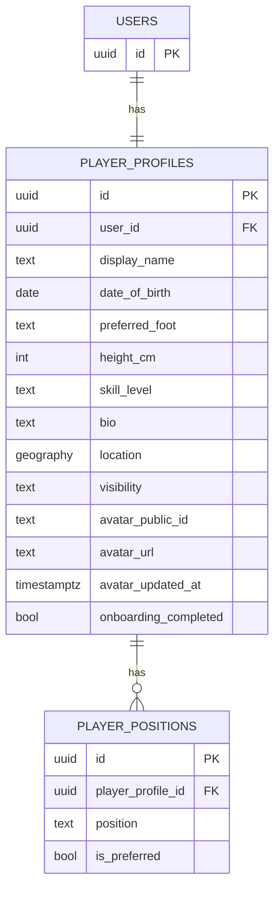
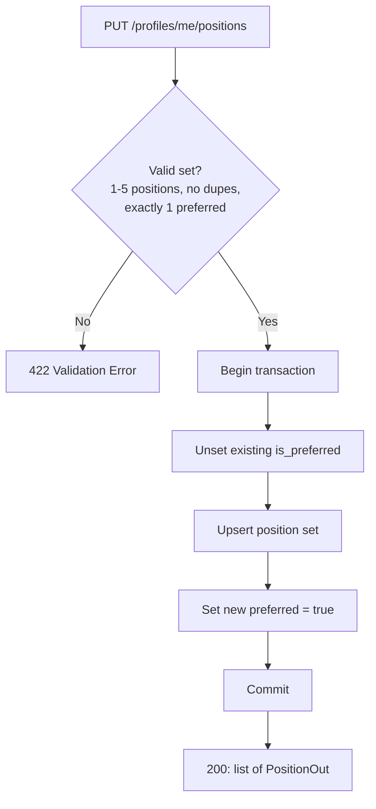
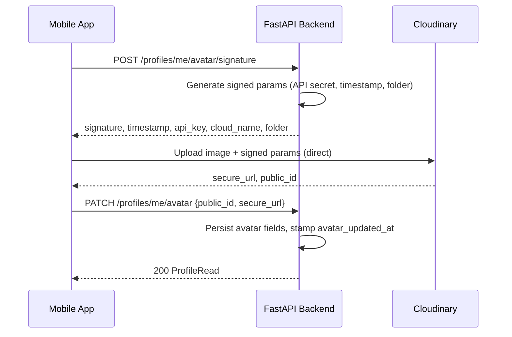

# Eleven — Player Profile System Design Spec (M0, Draft v1)

## 1. Overview & Scope

The player profile is the footballing identity layer — who someone is as a player — kept
separate from account identity (Auth0 / `users` / `user_identities`). A profile belongs to
a `user`, not to any single Auth0 identity.

**In scope for M0**
- Core profile fields (name, bio, DOB, physical info, skill level, visibility, location)
- Positions: up to 5 per player, one marked preferred
- Profile picture via Cloudinary
- Public vs private field visibility

**Out of scope for M0** (see §6)
- Stats/match history aggregation, peer ratings, badges, follow/friend graph,
  location-based search

---

## 2. Data Model

### 2.1 `player_profiles`

| Column | Type | Notes |
|---|---|---|
| `id` | PK | |
| `user_id` | FK → `users.id`, unique, `ON DELETE CASCADE` | 1:1 with `users`, not `user_identities` |
| `display_name` | text | may diverge from account name |
| `date_of_birth` | date, nullable | never returned raw in public view |
| `preferred_foot` | enum: `left`, `right`, `both`, nullable | |
| `height_cm` | int, nullable | range-validated |
| `skill_level` | enum: `beginner`, `intermediate`, `advanced`, `pro`, nullable | |
| `bio` | text, nullable | length-capped (e.g. 500 chars) |
| `location` | `geography(Point, 4326)`, nullable | PostGIS, captured but not queried in M0 |
| `visibility` | enum: `public`, `private` | default `public` |
| `avatar_public_id` | text, nullable | Cloudinary public ID |
| `avatar_url` | text, nullable | Cloudinary `secure_url`, stored directly |
| `avatar_updated_at` | timestamptz, nullable | for client-side cache-busting |
| `onboarding_completed` | bool | default `false` |
| `created_at` / `updated_at` | timestamptz | |

### 2.2 `player_positions`

A player can hold **up to 5 positions**, exactly one marked preferred — modeled as a join
table rather than an array column, since "one of N marked preferred" is much easier to
constrain and query as rows.

| Column | Type | Notes |
|---|---|---|
| `id` | PK | |
| `player_profile_id` | FK → `player_profiles.id`, `ON DELETE CASCADE` | |
| `position` | enum (see 2.3) | |
| `is_preferred` | bool | default `false` |
| `created_at` | timestamptz | |

**Constraints**
- `UNIQUE (player_profile_id, position)` — no duplicate positions per player
- `CREATE UNIQUE INDEX one_preferred_per_player ON player_positions (player_profile_id) WHERE is_preferred = true;`
  — DB-level guarantee of at most one preferred position, in the same spirit as the
  loud-fail-over-silent-default preference from the auth/env work.
- Max 5 rows per `player_profile_id` — enforced in the service layer (a plain `COUNT`
  check before insert/replace). Not worth a trigger for M0.

**Relationships**



### 2.3 Position enum

`GK, CB, LB, RB, LWB, RWB, CDM, CM, CAM, LM, RM, LW, RW, SS, ST`

### 2.4 Skill level enum

`beginner, intermediate, advanced, pro`

---

## 3. Backend (FastAPI)

### 3.1 Layout (layered, not a feature package)

```
app/models/profile.py     # SQLAlchemy: PlayerProfile, PlayerPosition
app/schemas/profile.py    # Pydantic: ProfileUpdate, ProfileRead, ProfileReadPublic,
                          #           PositionSetIn, PositionOut, AvatarSignatureOut
app/services/profile.py   # get_or_create_profile, update_profile, replace_positions,
                          # get_avatar_signature, confirm_avatar, delete_avatar
app/services/cloudinary_client.py
app/routes/profiles.py    # depends on get_current_user from app.auth
```

### 3.2 API endpoints

| Method | Path | Description |
|---|---|---|
| `GET` | `/profiles/me` | Full profile for the authenticated user |
| `PATCH` | `/profiles/me` | Partial update to core fields (all optional) |
| `GET` | `/profiles/{user_id}` | Another user's profile, filtered by `visibility` |
| `PUT` | `/profiles/me/positions` | Replace the full position set (max 5, one preferred) |
| `POST` | `/profiles/me/avatar/signature` | Get signed Cloudinary upload params |
| `PATCH` | `/profiles/me/avatar` | Confirm upload, persist `public_id`/`url` |
| `DELETE` | `/profiles/me/avatar` | Remove avatar (Cloudinary destroy + null fields) |

`PUT /positions` replaces the whole set in one call rather than exposing add/remove/
set-preferred as three endpoints — matches the mobile UX of "pick your positions, mark
one preferred, save" as a single action.

### 3.3 Schemas & validation rules

- `PositionSetIn`: list of `{position, is_preferred}`, length 1–5, no duplicate
  `position` values, exactly one `is_preferred: true`. Reject otherwise with 422.
- `ProfileUpdate`: enums validated at the Pydantic layer (invalid strings rejected, not
  silently coerced); `bio` length-capped; `height_cm` range-checked (e.g. 100–230).
- Two read schemas: `ProfileRead` (full, `/me`) vs `ProfileReadPublic` (filtered — e.g.
  `display_name`, `avatar_url`, positions, skill_level; no `date_of_birth`, no `location`)
  so the visibility rule lives at the schema layer, not scattered through the router.

### 3.4 Business rules / service layer

- Profile creation is `get_or_create`, keyed on `user_id`, called from first-login
  provisioning — not a client-triggered "create profile" call.
- `onboarding_completed = true` requires at least one position set (with a preferred
  flagged). Nothing else is required to gate onboarding.
- `replace_positions` runs in a transaction: unset any existing preferred row, upsert the
  new set, then set the new preferred — avoids transiently violating the partial unique
  index.



### 3.5 Cloudinary integration

Avatars use Cloudinary specifically (image transformation + CDN on read), separate from
the S3-compatible storage used elsewhere. Worth confirming this split is intentional
rather than incidental — if you'd rather consolidate on one media store later, this is
the field to migrate.

Direct-to-cloud upload, mirroring the presigned-S3 pattern already used elsewhere — the
backend never touches image bytes:



1. Mobile calls `POST /profiles/me/avatar/signature`.
2. Backend generates a Cloudinary signature (timestamp, upload preset, folder
   `eleven/avatars/{user_id}`) using the Cloudinary SDK + `CLOUDINARY_API_SECRET`,
   returns `{ signature, timestamp, api_key, cloud_name, folder }`.
3. Mobile uploads the image directly to
   `https://api.cloudinary.com/v1_1/{cloud_name}/image/upload` with those signed params.
4. Cloudinary returns `secure_url` + `public_id`.
5. Mobile calls `PATCH /profiles/me/avatar` with `{ public_id, secure_url }`; backend
   persists them and stamps `avatar_updated_at`.
6. `DELETE` calls Cloudinary's destroy API with the stored `public_id`, then nulls the
   three avatar fields.

### 3.6 Environment variables

Following the loud-fail convention already in place for sensitive values:

```
CLOUDINARY_CLOUD_NAME=${CLOUDINARY_CLOUD_NAME:?error}
CLOUDINARY_API_KEY=${CLOUDINARY_API_KEY:?error}
CLOUDINARY_API_SECRET=${CLOUDINARY_API_SECRET:?error}
```

`CLOUD_NAME` and `API_KEY` are safe to expose to the mobile client; `API_SECRET` never
leaves the backend.

---

## 4. Mobile (React Native)

### 4.1 Screens / components

- **ProfileScreen** — view own or another user's profile; renders `ProfileRead` vs
  `ProfileReadPublic` shape depending on whose profile it is.
- **EditProfileScreen** — `react-hook-form` bound to `PATCH /profiles/me`.
- **PositionPickerScreen** — multi-select, capped at 5, built on React Native Reusables;
  tapping a star/badge on a selected position marks it preferred (selecting a new
  preferred auto-unmarks the previous one client-side, ahead of the `PUT`).
- **AvatarPicker** — image selection → crop/compress → upload flow (4.3).

### 4.2 State management

- **TanStack Query** for all of it — this is server state end to end:
  - `useProfile(userId?)` — `GET /me` or `GET /{user_id}`
  - `useUpdateProfile()` — mutation → `PATCH /me`, invalidates `useProfile`
  - `useUpdatePositions()` — mutation → `PUT /me/positions`, invalidates `useProfile`
  - `useUploadAvatar()` — orchestrates the 3-call avatar flow, invalidates `useProfile`
- **Zustand**: not needed for this module — there's no cross-screen ephemeral state that
  outlives a single form.
- In-progress edits live in `react-hook-form` state / `useState` (e.g. selected positions
  before save), matching the local/ephemeral-state convention already in use.

### 4.3 Avatar upload client flow

1. Select an image from the camera or photo library.
2. Crop to square and compress client-side before upload.
3. Request signed params: `POST /profiles/me/avatar/signature`.
4. Direct multipart upload to Cloudinary's upload endpoint using the signed params.
5. On success, `PATCH /profiles/me/avatar` with the returned `public_id`/`secure_url`.
6. TanStack Query invalidates the profile query; UI reflects the new avatar via
   `avatar_url` (append `avatar_updated_at` as a cache-busting query param if needed).

### 4.4 Position picker UX

- Up to 5 selectable, no ranking among the non-preferred ones beyond selection order
  (flagged as an open question in §7 — happy to add explicit ordering if you want it).
- Exactly one preferred, enforced client-side before enabling the save button, mirroring
  the server-side constraint.

### 4.5 Form validation

`react-hook-form` with client-side validation matching the enums and ranges in the
Pydantic schemas 1:1, so invalid states are caught before the request ever leaves the
client.

---

## 5. API Contract Summary

| Method | Path | Auth | Body | Response |
|---|---|---|---|---|
| GET | `/profiles/me` | required | — | `ProfileRead` |
| PATCH | `/profiles/me` | required | partial `ProfileUpdate` | `ProfileRead` |
| GET | `/profiles/{user_id}` | required | — | `ProfileRead` or `ProfileReadPublic` |
| PUT | `/profiles/me/positions` | required | `PositionSetIn` (1–5, one preferred) | `list[PositionOut]` |
| POST | `/profiles/me/avatar/signature` | required | — | `AvatarSignatureOut` |
| PATCH | `/profiles/me/avatar` | required | `{public_id, secure_url}` | `ProfileRead` |
| DELETE | `/profiles/me/avatar` | required | — | 204 |

---

## 6. Out of scope for M0

- Stats / match history aggregation
- Peer ratings or endorsements
- Badges / achievements
- Follow / friend graph
- Location-based search ("find players near me") — data captured, querying deferred

---

## 7. Open questions / flagged assumptions

- **Ranking beyond preferred**: spec currently treats the 4 non-preferred positions as an
  unordered set. If you want them ranked (2nd choice, 3rd choice, etc.), that's a small
  addition (`rank` int column) — confirm if needed.
- **Avatar URL storage**: storing Cloudinary's `secure_url` directly rather than deriving
  it from `public_id` + cloud name on every read — simpler for the mobile client, at the
  cost of needing a re-sync if you ever change transformation params globally.
- **Cloudinary vs. S3 split**: confirming avatars living on Cloudinary while other future
  media (e.g. match photos) stay on S3-compatible storage is the intended long-term
  split, not just an M0 shortcut.
