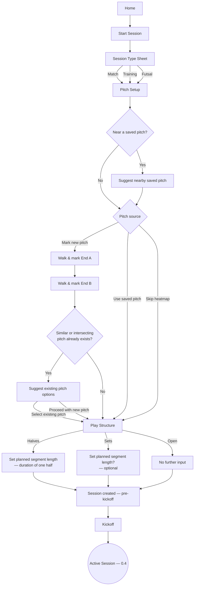
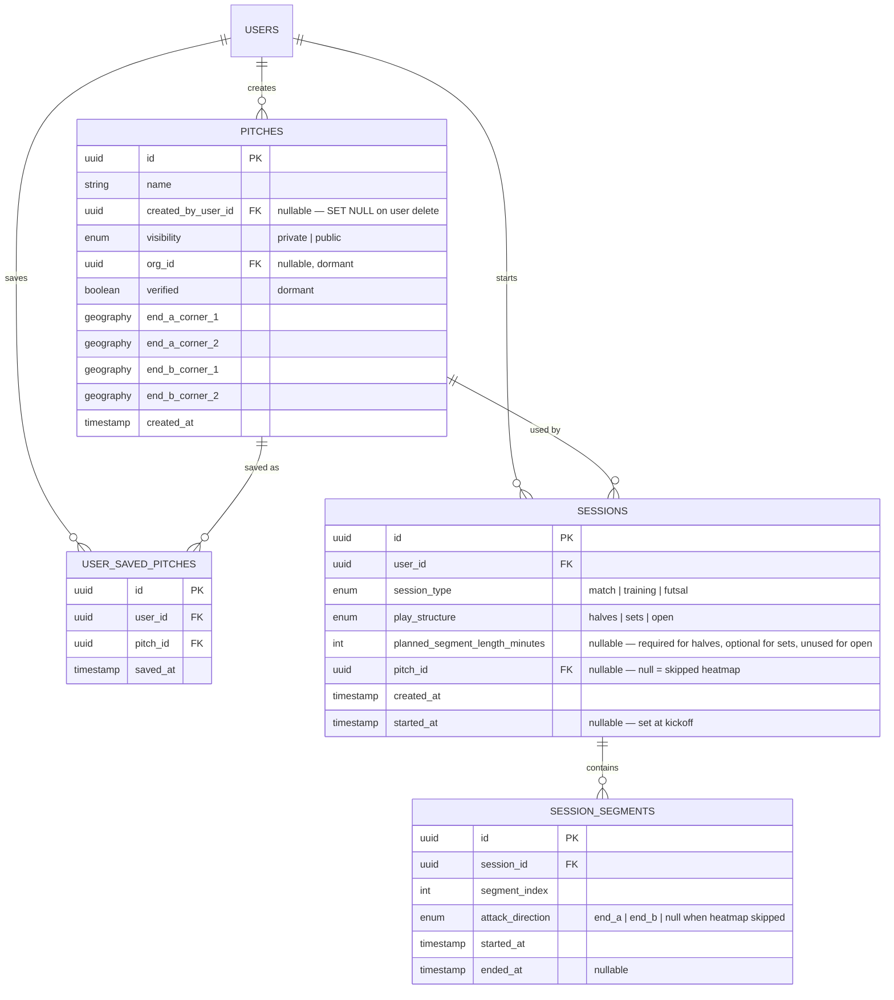

# Eleven — Session Start System Design Spec (Feature 0.3)

**Status:** Draft v2
**Milestone:** M0
**Feature:** 0.3 — Start Session (session type → pitch setup)

---

## 1. Scope

Feature 0.3 covers everything from tapping **Start Session** on Home through to the moment a session actually kicks off. It answers three questions before a single GPS point is recorded:

1. What are you playing? (session type)
2. How is the game structured? (play structure)
3. Where are you playing, and do you want a heatmap? (pitch setup)

At the end of 0.3, a `session` row exists in a pre-kickoff state with everything the live-tracking feature needs to start recording.

### Out of scope (explicitly deferred to other features)

| Item | Belongs to |
|---|---|
| Live GPS stream, timer, distance, speed, sprints, GPS quality | 0.4 |
| Pause / end session controls | 0.4 |
| "Start new set" control and half-time switch prompt (the runtime interactions) | 0.4 |
| Bearing/compass-based attack-direction auto-resolve | 0.4 |
| Session summary, calories, Wall brick, history | 0.5 |
| Heatmap generation / segment normalization (flipping GPS points to a common attack direction) | Heatmap feature (post-0.5) |
| Publishing a user-marked pitch as publicly discoverable | Deferred — schema field exists (`visibility`) but no UI/flow yet |
| Set outcome (win / lose / draw) tracking | Deferred — not modeled in this spec |
| Editing, deleting, or renaming a saved pitch | Deferred — not part of this spec |
| Real GPS accuracy tuning / permission request UX | 0.4 (though pitch-corner marking in 0.3 also consumes location — see §4.2) |

---

## 2. User flow



Session type is still passed as a route param, consistent with the current Expo Router wiring. Pitch setup and play structure now need to write real state (session + pitch data) rather than just navigating.

---

## 3. Session type

Session type (Match / Training / Futsal) selection is already built and doesn't change functionally in 0.3.

**Match format (11 / 7 / 5-a-side) is deferred, not part of this spec.** It only makes sense once team composition exists — right now Eleven is built entirely from a single-user perspective (one player's own GPS, stats, heatmap), with no concept of a roster or opposing team on the platform yet. Capturing a format now would be metadata with nothing to attach it to. It can be reintroduced cleanly later since it doesn't touch pitch geometry either way — corners are physically walked at whatever pitch the user is standing on, not templated to a format.

---

## 4. Pitch setup

### 4.1 Play structure (explicit question, no default)

Every session asks: **`play_structure`** = `halves` | `sets` | `open`.

- **`halves`** — two fixed teams, a defined midpoint where ends swap. Prompts for **planned segment length** (minutes) at setup — this drives the half-time nudge in 0.4, at which point crossing that mark surfaces the confirm-style switch prompt.
- **`sets`** — team composition rotates (loser-out, draw-both-out street-football style). Also prompts for **planned segment length** at setup, but optional rather than required — since a set genuinely ends on score, not a clock, a duration here can't drive an automatic rotation the way it does for halves. Instead, hitting that mark in 0.4 surfaces the same kind of soft nudge ("This set has run 15 min — start a new one?") as a reminder, not an assumption that rotation happened; the user still controls "Start new set" directly regardless of whether a length was set.
- **`open`** — solo training, drills. No ends to defend, so attack direction / End A / End B marking is skipped entirely for this structure, and no segment length applies.

Both `halves` and `sets` share the same underlying field — `planned_segment_length_minutes` — since they're both segment-based structures; only the semantics of what happens when it's crossed differ.

**Input is free-form minutes, with quick-select presets** rather than one or the other — the user can tap a preset or type a custom number, both writing to the same field:

| Structure | Presets shown |
|---|---|
| `halves` | 45 / 35 / 20 |
| `sets` | 20 / 15 / 10 (shorter, matching typical street-football set lengths) |

Segments are **not capped** at 2 for `halves`. Stoppage time, pauses, or extra periods are real possibilities; the segment count is left open-ended rather than DB-enforced, and can be revisited if it turns out to need a real constraint later.

**Set outcome is not tracked.** No winner/loser/score field exists on `session_segments` in this spec — segments only record when they started, ended, and which end was being attacked.

### 4.2 End A / End B corner marking

Rather than marking four unordered corners, pitch setup asks the user to walk and mark two **ends**, two corners each:

1. Walk to End A, mark its two corners
2. Walk to End B, mark its two corners

This replaces the earlier "just walk 4 corners" idea. The reason: normalizing heatmap data across segments later requires reflecting GPS points around the pitch's centerline whenever a segment attacked the opposite end. That reflection needs a **fixed reference frame** — the two ends — not an inferred label like "left" that has no stable meaning outside the moment it was set. Tagging corners by end at marking time removes the ambiguity up front, rather than trying to infer it from corner order later (which won't hold for irregular street/astro pitches).

This is the one piece of the eventual heatmap-normalization work that has to happen in 0.3 — everything else (the actual point-reflection math) is downstream and out of scope here (see §1).

### 4.3 Pitch matching & duplicate prevention

Two separate checks, at two different moments, both aimed at the same goal — don't make the user mark a pitch that already exists. Both use the same scope: **the user's own pitches plus any `visibility = public` pitches — never other users' private pitches.**

**Before marking — proximity nudge.** On arriving at Pitch Setup, Eleven checks the device's current location against that same pool (own pitches + public pitches). If a close match is found, it's surfaced as a suggestion at the "Pitch source" step (e.g. "You're near Lekki Astro — use this?") before the user commits to walking and marking anything new. Selecting the suggestion works the same as picking from Saved Pitches — the pitch is added to `user_saved_pitches` if it isn't already there.

**After marking — duplicate/similar check.** Once both ends are marked, before the pitch is finalized, Eleven checks whether the newly-marked geometry matches something that already exists rather than blindly creating a duplicate. Two checks, using the corner geometry already captured:

- **Intersects** — does the new pitch's polygon overlap an existing pitch's polygon? (PostGIS `ST_Intersects`)
- **Near-duplicate** — even without a clean overlap, is an existing pitch's centroid within a small tolerance distance (e.g. a few metres) of the new one? This catches the case where two people mark the "same" pitch slightly differently due to GPS drift — consistent with the ±2 m-ish accuracy range consumer GPS realistically gives.

If either check turns up candidates, the user sees a short list ("A pitch matching this location already exists") and can either **select one of the existing pitches** (discarding the just-walked corners, saving that pitch to their list instead) or **proceed and create the new one anyway** — this is a suggestion, not a block.

**Scope of what's checked (decided):** the user's own previously-created pitches and any `visibility = public` pitches. Other users' private pitches are excluded entirely — a private pitch shouldn't surface just because someone else happened to mark the same spot.

Neither check needs new columns on `pitches` — both are spatial queries against the existing corner geometry, run at the relevant moment (device location at Pitch Setup entry, or proposed corners at marking completion), filtered by the same visibility rule. A spatial index on the corner geometry keeps this fast as the table grows.

### 4.4 Skip flow

Unchanged in intent from the current mock behavior: proceeds straight to kickoff with `pitch_id = null`. No corners, no attack direction, no heatmap eligibility for that session. This needs to actually propagate now (currently it's pure navigation with no state change).

### 4.5 Saved pitches

Both **user-scoped** and **venue-scoped** ownership are supported from the start, via a split rather than a single flagged table:

- `pitches` — the canonical record (geometry, name, who created it, visibility). Creating a pitch and *saving* a pitch are different actions.
- `user_saved_pitches` — a join table recording which pitches a given user has bookmarked for quick reuse, independent of who created them.

This split matters because a single "is this mine" flag collapses the moment a user wants to bookmark a pitch someone else marked (a public venue, later, when clubs manage venues centrally) — ownership and saving need to stay separable.

For 0.3: every new pitch defaults to `visibility = private`, created by the marking user, and is automatically added to that user's `user_saved_pitches`. `org_id` and `verified` columns exist on `pitches` but are dormant — no UI, no org concept yet. This keeps the door open for club-managed venues later without a schema migration.

**Deferred:** any flow to make a pitch publicly discoverable (a "publish this pitch" toggle). The `visibility` field exists; the flow to change it does not, per your call to defer this.

Saved-pitch UI (e.g. "Use saved · Lekki Astro") selects a `pitch_id` directly and skips corner marking — the same End A / End B data from that pitch's original marking is reused.

---

## 5. Data model



Notes on this model:

- ORM class for `sessions` is `PlaySession` (avoids colliding with `sqlalchemy.orm.Session`); table name remains `sessions`.
- `pitches.created_by_user_id` is nullable with `ON DELETE SET NULL` so deleting a user does not block account removal; the pitch row remains (creator attribution cleared). Under current visibility rules, a still-`private` pitch with a null creator is no longer discoverable as “own” — access for shared/team cases is deferred to a later ACL/`org_id` model.
- `pitches` corners are stored as four separate geography points rather than a single polygon, so each corner keeps its End A / End B tag directly.
- `user_saved_pitches` has a unique constraint on `(user_id, pitch_id)`.
- `session_segments` belongs conceptually to 0.4's runtime behavior (creating and closing segments happens during an active session), but the schema is locked here because 0.3's play-structure and pitch decisions directly shape what it needs to store.
- For `play_structure = open`, no `session_segments` rows are created at all.
- `attack_direction` is **nullable** so halves/sets sessions that skip heatmap (`pitch_id = null`) can still create a timer segment without an End A/B direction.
- No half-count constraint is enforced at the DB level for `halves` (see §4.1) — if it becomes a real requirement later it would likely be an application-layer check rather than a DB constraint, similar to how the positions partial-unique-index pattern was scoped specifically because it *was* a clean DB-level invariant; this one isn't.

---

## 5.1 Layered files (backend)

| Layer | Files |
|---|---|
| Models | `app/models/pitch.py`, `app/models/session.py` |
| Schemas | `app/schemas/pitch.py`, `app/schemas/session.py` |
| Services | `app/services/pitch.py`, `app/services/session.py` |
| Routes | `app/routes/pitches.py` (`/pitches`), `app/routes/sessions.py` (`/sessions`) |
| Tests | `tests/test_pitches.py`, `tests/test_sessions.py` |

---

## 6. API surface

All endpoints require a valid Auth0 bearer token (`get_current_user`). Paths are unversioned, matching `/profiles` and `/me`.

Shared location shape: `{ "lat": number, "lng": number }` (same ranges as profile location).

### Pitches

**`GET /pitches/nearby?lat=&lng=`** — visible pitches (own + public) within configured nearby radius; each item includes `distance_meters`. Capped by `pitch_suggest_limit`.

**`POST /pitches/check-similar`**

```json
{
  "end_a_corner_1": { "lat": 6.45, "lng": 3.39 },
  "end_a_corner_2": { "lat": 6.45, "lng": 3.391 },
  "end_b_corner_1": { "lat": 6.451, "lng": 3.39 },
  "end_b_corner_2": { "lat": 6.451, "lng": 3.391 }
}
```

Returns matching visible pitches (intersects or near-duplicate centroid). Suggestion only — not a block.

**`POST /pitches`** — create + auto-save for the current user (`visibility=private`).

```json
{
  "name": "Lekki Astro",
  "end_a_corner_1": { "lat": 6.45, "lng": 3.39 },
  "end_a_corner_2": { "lat": 6.45, "lng": 3.391 },
  "end_b_corner_1": { "lat": 6.451, "lng": 3.39 },
  "end_b_corner_2": { "lat": 6.451, "lng": 3.391 }
}
```

**`GET /pitches/saved`** — list pitches in `user_saved_pitches` for the current user.

**`POST /pitches/{pitch_id}/save`** — bookmark a visible pitch (idempotent). 404 for other users' private pitches.

**`DELETE /pitches/{pitch_id}/save`** — unsave only (204); does not delete the `pitches` row.

Pitch read shape: `id`, `name`, `created_by_user_id` (nullable), `visibility`, `verified`, four corner `LocationOut`s, `created_at`. Nearby adds `distance_meters`.

### Sessions

**`POST /sessions`** — create pre-kickoff row (`started_at = null`).

```json
{
  "session_type": "match",
  "play_structure": "halves",
  "planned_segment_length_minutes": 45,
  "pitch_id": null
}
```

Validation (422):
- `halves` → `planned_segment_length_minutes` required (`1`–`180`)
- `sets` → length optional (same range if present)
- `open` → length must be omitted
- `pitch_id` set → must be visible (own or public); auto-saved to `user_saved_pitches` if not already

**`POST /sessions/{session_id}/start`** — kickoff (handoff into 0.4).

```json
{ "attack_direction": "end_a" }
```

- 404 if missing or not owned; 409 if already started
- Sets `started_at` (UTC now)
- `play_structure = open` → no `session_segments` row
- otherwise → creates segment `index=1` with `started_at` equal to session start
  - `attack_direction` **required** when `pitch_id` is set
  - omit / store null when `pitch_id` is null (skip heatmap)

Response includes the session and any created `segments`.

---

## 7. Open questions

None outstanding — all decisions for 0.3 are settled as of this draft. (Match format was ruled out of scope entirely in §3, not deferred as an open question, since it doesn't apply until team composition exists.)

---

## 8. Notes for downstream features

- **0.4** owns: GPS stream, the "Start new set" control, the half-time confirm nudge, and the bearing/compass mechanic that resolves `attack_direction` from the user's facing direction against End A/End B reference points (derived at runtime as the midpoint of each end's two corners — no new schema needed for this).
- **Heatmap generation** (post-0.5) owns: the actual point-reflection math that normalizes all segments to a single attack direction using the End A/End B geometry captured here.
- **Publish-pitch-publicly** flow is deferred; `pitches.visibility` exists so this can be added without a migration.
