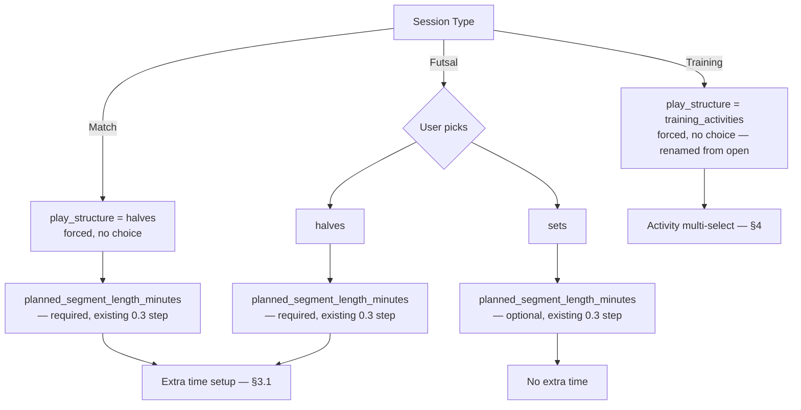
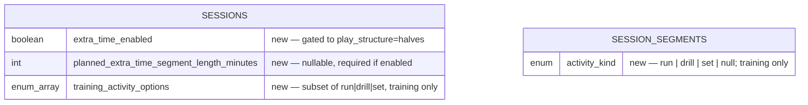

# Eleven — Session Structure Extensions Spec

**Status:** Draft v1
**Milestone:** M0
**Amends:** `eleven-session-start-system-design-spec.md` (0.3) and `eleven-gps-tracking-system-design-spec.md` (0.4)

---

## 1. Purpose & how to use this document

0.3 and 0.4 originally treated `play_structure` (`halves | sets | open`) as a free choice for
every session type, with a single shared `planned_segment_length_minutes` field. This spec
captures a set of decisions that make session structure **depend on `session_type`**
(match / futsal / training each get a different, constrained set of options), adds two
new structural concepts — **extra time** and **training activity kinds** — and **renames**
the `open` enum value to `training_activities` now that it carries real structure.

Rather than folding these into the base 0.3/0.4 docs piecemeal, they're captured here as one
self-contained amendment, decided in full before implementation, so the two feature specs
each only need a single, complete update instead of being revisited feature-type by
feature-type as new session types get their own rules.

Every section below is tagged **[0.3]** or **[0.4]** so this doc can be fed directly into
each feature's spec-drafting process as source material. Nothing in this document
contradicts the base specs except where explicitly called out in §7 (Corrections).

---

## 2. Session type → play structure constraints **[0.3]**

`play_structure` is no longer a free choice across all session types. Each `session_type`
constrains it:

| `session_type` | Allowed `play_structure` | Notes |
|---|---|---|
| `match` | `halves` only | No user choice — forced, not defaulted. Reject any other value. |
| `futsal` | `halves` \| `sets` | `training_activities` is not offered. |
| `training` | `training_activities` only | **Renamed from `open`** — see §7.1 for rationale and the required base-spec update. |



**Validation rule at `POST /sessions`:** reject the request if `play_structure` doesn't
match the allowed set for the given `session_type`.

**Nothing about the existing duration step changes.** Whatever `play_structure` a match
or futsal session ends up with, the base 0.3 flow for `planned_segment_length_minutes`
(§4.1 of the base spec) still runs exactly as originally specified — **required** for
`halves` (match, or futsal-halves), **optional** for `sets` (futsal-sets only), same
preset + free-form input pattern, same presets (45/35/20 for halves, 20/15/10 for sets).
This amendment does not touch that field or that step at all — it only adds a **second,
separate** duration step (extra-time length, §3.1) immediately after it, and only when
`play_structure = halves`.

---

## 3. Extra time (match & futsal-halves only) **[0.3 setup, 0.4 runtime]**

### 3.1 Setup fields **[0.3]**

This is a **second, additional** duration step — it comes after, and does not replace,
the existing `planned_segment_length_minutes` step from base 0.3 (see the note at the
end of §2). Two new fields on `sessions`, both gated to `play_structure = halves`:

| Field | Type | Rule |
|---|---|---|
| `extra_time_enabled` | boolean | Explicit, no silent default — same principle as `play_structure` having no default in the base 0.3 spec. |
| `planned_extra_time_segment_length_minutes` | int, nullable | Required if `extra_time_enabled = true`. Same preset + free-form pattern as the existing length field, but shorter presets (e.g. **15 / 10 / 5**) rather than the regular-half presets. |

**Gating rule:** `extra_time_enabled` must be `false`/`null` whenever `play_structure ≠
halves` — i.e. never available for futsal-sets, never for training. This applies to match
always (since match is always `halves`) and to futsal only when futsal picked `halves`.

### 3.2 Runtime behavior — "Add Extra Time" **[0.4]**

- New control, surfaced only after segment 2 (the second regular half) closes, only if
  `extra_time_enabled = true`.
- Tapping it closes into segment 3, and a second tap (if needed) into segment 4 — reusing
  the exact same "close current segment → open next" mechanism already spec'd for
  **Start New Set** / the half-switch control in 0.4.
- The segment's driving length is `planned_extra_time_segment_length_minutes`, pulled
  automatically — **the user is not re-prompted** for a length at this point.
- This is a decision the user makes *in the moment*, after seeing how the match played
  out — setup only pre-configures the length in case they choose to use it.

### 3.3 Regular vs. extra-time phase — derived, not stored

**No new column** (e.g. no `segment_phase`) is added to distinguish regular halves from
extra time. For `play_structure = halves`, phase is derived purely from `segment_index`:

| `segment_index` | Phase |
|---|---|
| 1 | 1st Half |
| 2 | 2nd Half |
| 3 | ET 1 (only exists if Add Extra Time was tapped) |
| 4 | ET 2 (only exists if tapped again) |

This derivation rule is intentionally simple because the ET shape (max 2 extra halves,
always following exactly 2 regular halves) is fixed and not expected to change. If that
ever changes, this is the point where an explicit `segment_phase` column would need to be
introduced — noted here so the tradeoff isn't silently forgotten.

**Any UI or downstream feature that displays a segment label for `halves` must derive it
from this table — not store or infer it any other way.**

### 3.4 Extra-time-length display **[0.4]**

Extra-time segments use `planned_extra_time_segment_length_minutes` — not the regular
`planned_segment_length_minutes` — as the basis for the existing "planned length exceeded /
extra-time counter" display behavior already spec'd in 0.4 §4.1.

---

## 4. Training — activity multi-select & segment kind **[0.3 setup, 0.4 runtime]**

### 4.1 `open` → `training_activities` — enum rename **[0.3 / correction]**

The `play_structure` value used for training is **renamed from `open` to
`training_activities`.** This isn't a cosmetic change — `open` originally meant "no
structure, no segments, no attack direction, ever." That's no longer accurate: training
sessions now create real `session_segments` rows (one per run/drill/set instance, §4.3)
and may populate `attack_direction` on `set` segments (§4.4). Keeping the name `open`
would leave anyone reading the base spec with the old, now-incorrect mental model.
`training_activities` names the actual mechanism instead.

This is a **value rename on an existing enum**, not a new value added alongside `open` —
`open` is retired entirely; every reference to it across 0.3 and 0.4 (schema, API docs,
flow diagrams) needs updating to `training_activities`. See §7.1 for the full list of
what that touches in the base 0.3 spec.

### 4.2 Activity multi-select **[0.3]**

At setup, a training session lets the user select **one or more** of:

```
run | drill | set
```

- **Storage: array column.** `sessions.training_activity_options: activity_kind[]`
  (subset of `{run, drill, set}`), required, minimum 1 item.
  - Chosen over a join table because there's no per-item setup metadata — no per-type
    planned duration, no ordering. Duration for any given run/drill/set is decided **in
    the moment**, when the user starts that instance during the session — not configured
    at setup. If a per-type setup attribute is ever needed later, this would need to
    migrate to a join table (matching the `player_positions` / `user_saved_pitches`
    pattern) — flagged here so it's a conscious tradeoff, not an oversight.
- Required only when `session_type = training`; irrelevant/absent otherwise.

### 4.3 Segment creation & `activity_kind` **[0.4]**

- Each run/drill/set the user starts inside the session creates a new `session_segments`
  row, `segment_index` incrementing as usual — free start/stop, no fixed count or
  duration enforced.
- New column: **`session_segments.activity_kind`** — nullable enum `run | drill | set`.
  Populated for training segments only; `null` for match/futsal segments.
- **Label derivation:** wherever a training segment is displayed, the label is derived
  from `activity_kind` + occurrence count (e.g. "Drill 2") — not stored separately.
- **No "planned length exceeded" display applies to training.** Training has no planned-
  length concept anywhere (setup or runtime), so the extra-time-style counter UI (§3.4)
  is explicitly out of scope for all training segments regardless of `activity_kind`.

### 4.4 Pitch & attack direction for training "sets" **[0.3 setup, 0.4 runtime]**

- **[0.3]** If `set` is among the selected `training_activity_options`, the existing
  pitch-setup flow (proximity nudge, End A/End B marking, duplicate/similar check) is
  triggered, unchanged from the base 0.3 spec. If `set` is **not** selected, pitch setup
  is skipped entirely — no prompt shown.
- **[0.3]** One pitch per session, same as match/futsal — a training session does not
  support multiple pitches across different "set" instances.
- **[0.4]** Attack-direction resolution gets a **new conditional rule** for training,
  layered on top of the existing one:

  | `session_type` | Resolve `attack_direction` when... |
  |---|---|
  | match / futsal | `pitch_id` is not null |
  | training | `activity_kind = 'set'` **AND** `pitch_id` is not null |

  `run` and `drill` segments always get `attack_direction = null`, even in a training
  session that has a pitch attached (because `set` was also selected as an option).
  This is a **logic-only change** — `attack_direction` remains the same nullable enum,
  no schema impact.

---

## 5. Data model — delta only

This section shows fields **added** to the existing 0.3/0.4 schema, plus one **rename** to
an existing column's allowed values (not a new column): `sessions.play_structure`'s enum
changes from `halves | sets | open` to `halves | sets | training_activities` (§4.1, §7.1).
Everything else in those specs' ERDs (§5 of 0.3, §7 of 0.4) is unchanged.



| Table | Column | Type | Notes |
|---|---|---|---|
| `sessions` | `extra_time_enabled` | boolean | Default not silently assumed — explicit on create. Null/false unless `play_structure = halves`. |
| `sessions` | `planned_extra_time_segment_length_minutes` | int, nullable | Required iff `extra_time_enabled = true`. |
| `sessions` | `training_activity_options` | enum array | Subset of `{run, drill, set}`, min 1 item, required iff `session_type = training`. |
| `session_segments` | `activity_kind` | enum, nullable | `run \| drill \| set`. Populated for training segments only. |

No columns are added to `pitches`, `user_saved_pitches`, or `session_track_points` — this
amendment is scoped entirely to `sessions` and `session_segments`.

---

## 6. API surface — delta only

### `POST /sessions` **[0.3]** — new/changed request fields

| Field | Required when | Notes |
|---|---|---|
| `extra_time_enabled` | `play_structure = halves` (optional elsewhere, must be false/null) | |
| `planned_extra_time_segment_length_minutes` | `extra_time_enabled = true` | |
| `training_activity_options` | `session_type = training` | Min 1 of `run \| drill \| set` |

Validation additions:
- Reject `play_structure` values not permitted for the given `session_type` (§2).
- Reject `extra_time_enabled = true` when `play_structure ≠ halves`.
- Reject missing/empty `training_activity_options` when `session_type = training`.

### Runtime endpoints **[0.4]**

No new endpoints. "Add Extra Time" and starting a training activity both reuse the
existing segment-transition mechanism already defined in 0.4 (the same one powering
Start New Set / half-switch) — closing the current segment and opening the next, with
`activity_kind` (training) or nothing (halves/ET) set on the new row as appropriate.
Consistent with 0.4's local-first decision, these transitions are **not** synced live —
they travel in the end-of-session batch (`finalize` + `track-points`) as before.

---

## 7. Corrections to existing specs

### 7.1 `eleven-session-start-system-design-spec.md` — enum rename + meaning correction

**The value itself changes:** every occurrence of `play_structure = open` in the base 0.3
spec must be updated to `play_structure = training_activities`. This includes at minimum:
- §1 scope table and §4.1 prose (`halves | sets | open` → `halves | sets | training_activities`)
- §5 data model / ERD (`enum "halves | sets | open"` on `SESSIONS.play_structure`)
- §6 API surface (`POST /sessions` request body description)
- Any flow diagram (§2) showing `open` as a branch label

**The meaning also changes, independent of the rename.** The original spec states, for
`open`: *"No ends to defend, so attack direction / End A / End B marking is skipped
entirely for this structure, and no segment length applies"* and elsewhere that `open`
sessions produce no `session_segments` rows at all. As of this amendment, that's no
longer accurate for what's now `training_activities` — those sessions **do** create
`session_segments` rows (one per run/drill/set instance, §4.3), and **may** get
`attack_direction` populated on `activity_kind = 'set'` segments specifically, conditional
on a pitch being attached (§4.4). What remains true: 0.3 still does not dictate segment
count, segment length, or require pitch geometry for `training_activities` — those stay
fully user-driven, unlike `halves`/`sets`.

**Net effect for whoever updates the base 0.3 spec:** treat this as replacing `open`
wholesale with `training_activities`, carrying the corrected meaning above — not as
adding a new value alongside a retained `open`.

### 7.2 `eleven-gps-tracking-system-design-spec.md` §4.4

The existing "Resolved" note (*"if `pitch_id` is null... `attack_direction` is left
null"*) still holds as written for match/futsal. It's now joined by the additional
`activity_kind`-based condition for training described in §4.4 above — the two rules
apply together, not in place of each other.

---

## 8. Out of scope (unchanged from base specs, restated for clarity)

- Match format (11/7/5-a-side) — still deferred per 0.3 §3, untouched by this amendment.
- Set outcome (win/lose/draw) tracking — still not modeled.
- Per-training-activity-type planned duration at setup — explicitly decided against (§4.2);
  duration is a runtime, per-instance decision only.
- Multiple pitches within a single training session — one pitch per session, same as
  match/futsal (§4.4).
- Any change to the heatmap-normalization/point-reflection work — still fully downstream
  and untouched by this amendment.

---

## 9. Decision log

| # | Decision | Resolution |
|---|---|---|
| 1 | Segment classification: one shared field or two (phase + activity kind)? | Two separate mechanisms: `activity_kind` (stored column, training only) + phase derived from `segment_index` (no column, halves only). |
| 2 | Should extra-time phase be an explicit column? | No — derived from `segment_index` (1–2 regular, 3–4 ET). Revisit only if the fixed 2-regular/2-ET shape ever changes. |
| 3 | Does training need a new `play_structure` value, or does `open` stay as-is? | `open` is **renamed** to `training_activities` (not kept, not added alongside) — the old name no longer matches its corrected meaning (§4.1, §7.1). |
| 4 | Do training "sets" carry pitch/attack-direction? | Optional — pitch selected/created at 0.3 only if `set` is chosen; attack direction resolved at 0.4 only for `activity_kind = 'set'` segments with a non-null `pitch_id`. |
| 5 | Training multi-select storage: array column or join table? | Array column (`training_activity_options`) — no per-item setup metadata needed; duration is decided at runtime per instance, not at setup. |

All five items above are closed as of this draft — no open questions remain.
