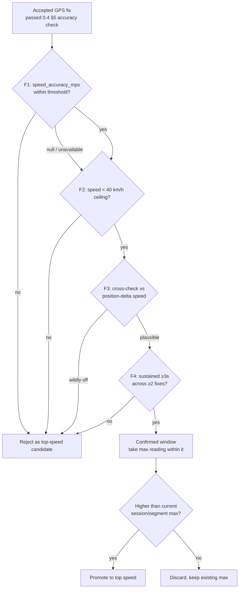

# Eleven — Speed Filtering & Top-Speed Determination System Design Spec (Feature 0.4.2)

**Status:** Draft v1
**Milestone:** M0
**Feature:** 0.4.2 — Speed filtering & top-speed determination
**Consumed by:** 0.4 (live HUD, in-session) and 0.5 (post-session authoritative value)

---

## 1. Why this is its own spec

Raw GPS speed readings are not directly trustworthy — particularly on Android, where a mid-range or budget device can report a spurious 40 km/h burst that never physically happened. Some filtering has to sit between the OS speed reading and any number a player is shown.

That filtering has **two consumers**: 0.4's live HUD (in-session, streaming) and 0.5's post-session computation (batch, authoritative). Describing it once, here, prevents two implementations drifting apart — and prevents the specific bug where the HUD shows 35 km/h mid-sprint and the summary reports 33 km/h afterward, which reads to a user as broken software rather than as two different algorithms.

**This spec owns:** what counts as a trustworthy speed reading, and how a top speed is determined from a stream or a trace.

**This spec does not own:** where speed data is captured or stored (0.4 §5, §7), how the HUD renders it (0.4 §3), where the final value is persisted, or sprint-effort modelling (both 0.5).

---

## 2. Why OS speed can't be trusted as-is

The design already prefers the OS-provided instantaneous speed field over differencing consecutive positions (0.4 §5) — that remains correct, since the OS value is typically Doppler-derived and lower-noise than position deltas. But it degrades badly under specific, common conditions:

- **Chipset fragmentation (Android).** Devices range from dual-frequency (L1+L5) GNSS down to single-frequency L1-only budget receivers. The latter are meaningfully worse at both position and speed, and are exactly the devices the PRD's own risk note flags as core to the target market.
- **Silent fallback.** Better chipsets derive speed from Doppler shift. Weaker ones can silently fall back to deriving speed from position deltas between fixes — amplifying position jitter into speed noise, with no signal to the app that this has happened.
- **Worst exactly where it matters.** Quick accelerations and direction changes — sprints and turns, the thing being measured — are the hardest case for any GPS speed estimator, and budget hardware handles them worst.

The consequence: a single unfiltered fix can set a wildly wrong "top speed" for an entire session. Since top speed is a headline number the player sees and shares, a single bad fix is disproportionately damaging to trust in the whole product.

---

## 3. Prerequisite: `speed_accuracy_mps`

This spec requires one field beyond what 0.4 v2 currently defines:

| Field | Source | Notes |
|---|---|---|
| `speed_accuracy_mps` | Android: `Location.getSpeedAccuracyMetersPerSecond()` (API 26+)<br/>iOS: `CLLocation.speedAccuracy` (iOS 10+) | Nullable — not reported by every device/OS version. Mirrors the existing `horizontal_accuracy_m` field exactly. |

This is the OS reporting its own confidence *in the speed value specifically*, rather than requiring that confidence be inferred from position quality. It's the single highest-value, lowest-effort filter available, which is why it leads §4.

**Schema impact:** `speed_accuracy_mps` is added to `session_track_points`, which is owned by 0.4 §7. That table needs updating alongside this spec.

**Fallback when null:** if a device doesn't report speed accuracy, filter F1 is skipped for that session and the remaining three filters carry the load. Sessions on such devices should be treated as lower-confidence — see §7.

---

## 4. The filter chain

Four filters, applied in order. A reading must pass all applicable filters to be eligible as a top-speed candidate.



Note that a rejected reading is only rejected **as a top-speed candidate** — the point itself is still stored in the trace with its speed value intact. Filtering governs what's allowed to set a record, not what gets recorded.

### F1 — Speed accuracy threshold

Reject as a candidate if `speed_accuracy_mps` exceeds the threshold (§6). Skipped entirely if the field is null.

### F2 — Physically implausible ceiling

Reject any reading at or above **40 km/h**. Grounded in reality rather than arbitrary: the fastest verified top speeds in professional football sit around 38 km/h (Mbappé). 40 gives headroom above the fastest real-world football sprint ever recorded while still catching obvious noise — and no recreational Sunday-league player is going to be legitimately clipped by it.

### F3 — Cross-check against position-delta speed

Compute a second speed estimate from the haversine distance between this fix and the previous accepted fix, divided by elapsed time. Compare it against the **average of the previous and current OS speed readings** — not against the current reading alone.

**Why the average.** Position-delta speed is inherently an *interval average*: it describes the whole gap between two fixes. The OS speed value is *instantaneous*. Comparing one against the other is not like-for-like, and the two diverge most during acceleration — precisely when a sprint peak occurs.

Worked example: a player accelerating from a standstill to 30 km/h over 3 seconds covers roughly 12.5m. Delta-speed reports ~15 km/h; the OS reports ~30 km/h at the end of the interval. Compared against the current reading alone, that's 50% — sitting right on the rejection threshold, and a completely legitimate sprint peak gets thrown away. Compared against the interval average (~15 km/h), the two match almost exactly, and the reading passes as it should.

This also makes F3 robust to sampling rate. Comparing against the current reading alone gets *more* likely to produce false rejections as the gap between fixes grows, since a longer interval means a larger gap between "average over the interval" and "speed at the end of it." Averaging removes that dependency — no rate-aware threshold needed.

**Still a gross sanity check, not a precision match.** Position carries meaningful error (up to the 20m threshold from 0.4 §5), so the delta estimate stays noisy regardless. The rule is deliberately asymmetric and loose: reject only when delta-speed is *wildly* below the averaged OS speed (§6). That is the signature of a Doppler glitch — the OS insists the player was flying, but the player demonstrably didn't move that far.

Worked example of a genuine catch: a spurious 38 km/h reading where the previous fix was 8 km/h averages to 23 km/h, while delta-speed shows the player barely moved — around 8 km/h. At ~35% of the averaged value, it is comfortably rejected.

### F4 — Sustained duration

A single fix may not set a record. The reading must hold for **at least 3 seconds, across at least 2 accepted fixes**. A real sprint peak is not an instantaneous blip; a noise spike usually is.

**"Holding" means within a tolerance band, not an exact repeat.** Speed fluctuates naturally across a real sprint, and GPS adds its own jitter on top — demanding an identical value across consecutive fixes would reject essentially every legitimate peak.

The band is measured against a **fixed anchor: the reading that opens the window.** Each subsequent reading must satisfy:

```
|reading − anchor| ÷ anchor ≤ 0.15
```

Worked example: readings of 29.5, 30, 31 km/h. The anchor is 29.5. The furthest reading is 31, giving |31 − 29.5| ÷ 29.5 = 5.1% — comfortably inside the band, so the window confirms.

**The anchor must not update as the window progresses.** If the reference were the current fix, or the running maximum, the band would ratchet: 29.5 → 33 (11.9% of 29.5) → 37 (12.1% of 33) → 41 (10.8% of 37). Every individual step passes, and the value drifts from 29.5 all the way to 41 without a single step ever failing — only F2's 40 km/h ceiling would stop it, and then only by accident. With a fixed anchor the same sequence dies at 37, which is 25% away from 29.5 and outside the band. That is correct behavior: a genuinely sustained peak hovers around one value, while a sequence climbing steadily away from its origin is not a sustained peak at all.

**The recorded value is the maximum within the confirmed window.** In the first example the window opens on 29.5 but the peak recorded is 31. Every reading inside the window has already passed F1–F3 individually, so the 31 is not an unvalidated outlier — it is a filtered reading sitting inside a corroborated burst. Recording the opening anchor instead would systematically under-report every sprint in the app.

A direct consequence of the fixed anchor: the recorded value can never exceed `anchor × 1.15`. With an anchor of 29.5, the highest recordable speed in that window is 33.9 km/h. This is intended — the value stays tied to the first corroborated reading rather than chasing the noisiest one upward.

**Why duration, not a fix count.** Sampling rate is not guaranteed — ~1Hz is typical for continuous tracking, but a device on weak signal may deliver fixes far less often. Expressed as a count, "3 consecutive fixes" silently becomes a 9-second requirement at one fix every 3 seconds — a window no real sprint peak survives, so every legitimate top speed on that device would be rejected with no error and no visible failure. Expressing the rule in seconds keeps it correct at any sampling rate.

**Why a fix-count floor alongside it.** With duration alone, a slow-sampling device could satisfy "3 seconds" with a single fix, which defeats the entire purpose of the filter. The `≥2 fixes` floor guarantees corroboration always exists.

**Degradation is deliberate.** At slow sampling rates the check does get weaker — 2 fixes is less evidence than 3. That is accepted rather than solved, because the alternative considered (disabling F4 when sampling falls below some rate) removes noise rejection exactly when noise is worst: slow sampling is a symptom of weak signal, and weak signal is when speed readings are least reliable. A weakened filter under bad conditions beats no filter under bad conditions. F3 is unaffected either way — its averaged comparison (see above) is rate-independent by construction, so it neither compensates for nor compounds F4's degradation here.

---

## 5. Two execution contexts, one algorithm

The same chain runs in both places. The only difference is what data is available at the time.

| | 0.4 — live (HUD) | 0.5 — post-session (authoritative) |
|---|---|---|
| Input | Fixes arriving one at a time | Complete full-resolution local trace |
| F1, F2 | Per-point — no state needed | Identical |
| F3 | Needs the previous fix, which has already arrived | Identical |
| F4 | Needs the confirmation window to elapse *after* the candidate — so a confirmed peak appears in the HUD ~3s after it actually occurred | Full look-ahead available; no lag |
| Output | Transient, on-screen only | Persisted as the authoritative value |

**On the F4 lag:** the live HUD promotes a peak roughly 3 seconds after the moment it happened, because confirmation requires the sustained window to elapse. This is invisible in practice — nobody reads the HUD frame-by-frame mid-sprint — and it is the *only* behavioral difference between the two contexts.

**Why 0.5 re-runs the chain rather than trusting the HUD's value:** batch has full look-ahead where live does not, so 0.5's pass is strictly better-informed. In the overwhelming majority of sessions the two agree exactly. Re-running is what makes the stored number authoritative in the rare cases they don't — and it costs nothing, since 0.5 is already iterating the full trace for distance and other metrics anyway.

**Consistency with 0.4's existing model:** this doesn't move the 0.4/0.5 boundary. 0.4 already computes live, transient, screen-only values (elapsed time, distance-so-far are both running computations, not stored fields). A live filtered top speed is the same category — useful in the moment, not the source of truth. 0.5 still owns the durable record.

---

## 6. Tuning parameters

As with 0.4 §10, these are reasoned starting points, not values measured against real devices. They are prime candidates for revision once field data exists — see §7.

| Parameter | Value | Rationale |
|---|---|---|
| F1 — max `speed_accuracy_mps` | 2.0 m/s | Permissive enough not to starve budget devices of usable readings, tight enough to drop readings the OS itself has low confidence in |
| F2 — implausible ceiling | 40 km/h | Above the ~38 km/h fastest verified professional football sprint, with headroom |
| F3 — cross-check rejection | Reject if position-delta speed < 50% of the *averaged* (previous + current) OS speed | Catches Doppler glitches without demanding precision from a noisy secondary estimate; averaging keeps it like-for-like and rate-independent |
| F4 — sustained duration | ≥ 3 seconds | Physiologically sane for a real sprint peak, short enough not to miss genuinely brief bursts. Rate-independent by design |
| F4 — minimum fix floor | ≥ 2 accepted fixes | Guarantees corroboration even at slow sampling rates, where 3s might otherwise be covered by a single fix |
| F4 — tolerance band | `\|reading − anchor\| ÷ anchor ≤ 0.15`, where the anchor is the reading that opened the window and does not update | Speed fluctuates naturally across a real sprint, and GPS adds jitter; requiring an exact repeat would reject legitimate peaks. Loose at these speeds (15% of 30 km/h is 4.5 km/h), erring deliberately toward accepting real sprints over rejecting them |

---

## 7. Calibration & known limitations

**These values are unvalidated.** Every number in §6 is reasoned from general GPS practice and football physiology, not measured against the devices this will actually run on. This is a known soft spot, deliberately shipped rather than hidden.

**Why ship now rather than wait for better hardware.** A wearable (or any higher-accuracy tracker) would not change *what* gets built here — the four filters are correct regardless of data source. It would only change *how precisely §6 is tuned*. So there is no rework risk in building now, and gating M0 on hardware availability would block a milestone whose actual bar is "prove the habit," not sports-science-grade precision. Filtering takes the numbers from obviously-broken to reasonably-trustworthy, which is the bar that matters here.

**What a reference device would actually provide.** Not a production data source — a **ground truth for calibration**. Running a higher-accuracy tracker alongside the phone during real sessions is what converts §6 from defensible guesses into measured values: *this* phone's noise floor is X, its speed readings run Y% high under Z conditions. That is the specific unlock, and it's a tuning exercise, not a redesign.

**Known limitations to revisit with real data:**
- Devices that don't report `speed_accuracy_mps` lose F1 entirely and run on three filters. Worth tracking how common this is in the actual user base, and whether those sessions need a lower-confidence treatment in the UI.
- F4's `≥2 fixes` floor is a shape-correct guess, not a validated number. Worth measuring how often real sessions actually fall back to the 2-fix minimum — if slow sampling turns out to be common rather than exceptional, the weakened noise rejection in those sessions may need a different answer than accepting graceful degradation.
- Actual sampling rates on target devices are unmeasured. F4 is now rate-independent by construction, but sampling rate still affects trace density, HUD update frequency, and the accuracy of every metric 0.5 derives — worth characterising early on real hardware.
- F3's 50% threshold remains the loosest guess in the table. Averaging against the interval mean (§4) removes the acceleration-clipping problem that would otherwise have made this threshold dangerous, but whether 50% is the right level to catch real Doppler glitches without letting subtler ones through is still unmeasured.

---

## 8. Notes for adjacent specs

- **0.4** needs `speed_accuracy_mps` added to `session_track_points` (§3), and its HUD (§3) and point-capture (§5) sections should reference this spec rather than restating filter logic.
- **0.5** owns persisting the final top speed, and should be written to re-run this chain over the full trace rather than accept 0.4's live value (§5).
- **Peak location, for later:** if a future feature shows *where* on the pitch the top speed occurred, 0.5 should copy that fix's location onto its own computed record at the moment the peak is confirmed — rather than relying on locating that fix in the synced trace afterward. The synced trace is downsampled (0.4 §6), and while a genuine top-speed fix will comfortably clear the high-activity retention threshold, decoupling the feature from downsampling behavior entirely is the more robust move.
- **Downsampling is unaffected.** Filtering operates on the full-resolution local trace at capture and at session end; downsampling happens later, only at sync time (0.4 §6). A top-speed value is computed and stored before downsampling ever runs, so it cannot be erased by it.
- **The backend does not run this chain.** It cannot reproduce the result — the filters need the full-resolution local trace, and only the downsampled trace is synced. The client is authoritative for computed metrics; the server validates plausibility and corroboration at ingest instead. See 0.4 §8.1.
- **Trust becomes a real concern at M3.** For M0 the top speed is private and informational — fabricating it only fools the fabricator. Once football identity and comparison arrive and the number appears alongside other players', a client-computed value becomes a spoofable one, and the ingest checks in 0.4 §8.1 do not close that gap: they catch implausible values, not dishonest ones. The realistic attack is not defeating these filters but bypassing the client altogether — replaying a captured `finalize` request with an edited number, or feeding the app synthetic coordinates via a mock location provider, which produces a self-consistent trace that passes every check by construction. Options worth weighing when M3 is specced: syncing the full-resolution trace for competitive sessions so the server can verify independently; server-side plausibility scoring against the player's own history; or verification tied to sessions other players also attended, which M1's group-tracking model would support naturally. Deciding this deliberately at M3 is much cheaper than discovering it when the first fabricated record appears on a leaderboard.
