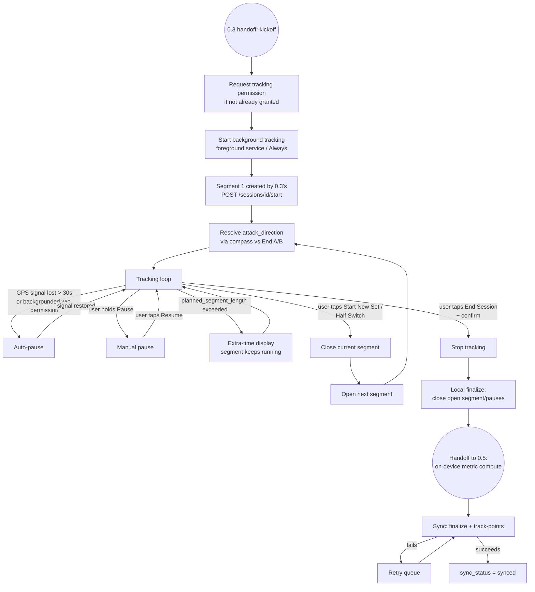
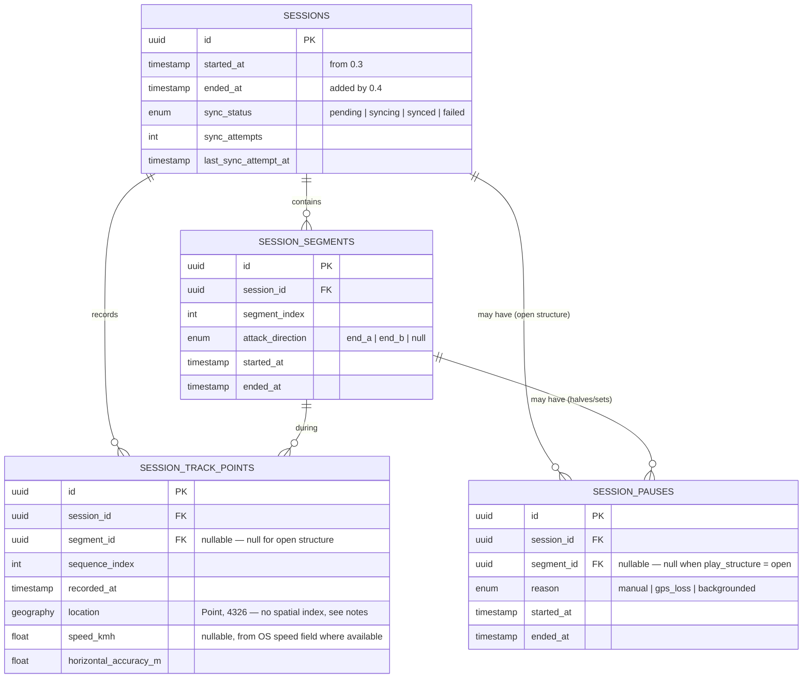

# Eleven — Phone-Based GPS Tracking System Design Spec (Feature 0.4)

**Status:** Draft v2
**Milestone:** M0
**Feature:** 0.4 — Phone-Based GPS Tracking (kickoff → raw trace capture → sync)
**Depends on:** 0.3 (Session Start) — consumes the `session` / `session_segments` interface it produces

---

## 1. Scope

Feature 0.4 covers everything from kickoff (the handoff point at the end of 0.3) through to a fully synced raw tracking record. Its job is narrow and deliberate: **capture an accurate raw GPS trace, reliably, with the right pause/segment behavior around it — and get it stored.** It does not turn that trace into performance numbers.

**In scope**
- Location permission flow (platform-specific), with a football-specific rationale
- Background tracking mechanism that survives a locked screen
- Live in-progress indicator: elapsed time, distance, top speed (where feasible)
- Auto-pause on GPS signal loss / insufficient background permission, with auto-resume
- Manual pause (hold-to-confirm) / resume (single tap)
- Extra-time display when `planned_segment_length_minutes` is exceeded — no auto segment switching
- "Start new set" / half-switch controls that close one segment and open the next
- Attack-direction resolution (compass bearing vs. End A/End B) at each segment's start
- Raw GPS point capture, with an accuracy filter
- Downsampling policy for the copy that gets synced
- Manual "End Session" with a confirm step
- Local-first storage, single batch sync at session end, with a retry queue

**Explicitly out of scope**

| Item | Belongs to |
|---|---|
| Computing distance, avg/top speed, sprint detection, calories, active-duration accounting | 0.5 |
| Session summary rendering | 0.5 |
| Sprint-effort history / top-N sprints per week/month/all-time | Post-M0 |
| Heatmap generation / point-reflection normalization | Post-0.5 |
| Route display on a map | Post-M0 |
| Multi-user / group tracking (multiple people under one session) | M1 |
| Match format (11/7/5-a-side) | Deferred per 0.3 §3 |

The guiding split: **0.4 owns rawness — what the GPS signal did and when tracking was and wasn't happening. 0.5 owns computation — what that raw data means.**

---

## 2. Lifecycle overview

For `play_structure = open`, there is no segment 1, no attack-direction step, no extra-time display, and no start-new-set control — pauses attach to the session itself rather than a segment (see §4.3).

---

## 3. Permissions

Permission handling differs meaningfully by platform, and the two-step iOS flow matters enough to spell out.

**Android** — a **foreground service** (persistent notification, e.g. "Eleven — tracking session, 12:34") keeps GPS flowing under standard "While using the app" access for as long as the notification is visible. `ACCESS_BACKGROUND_LOCATION` ("Allow all the time") is **not required** — the foreground service is the less invasive ask and the one Play Store scrutinizes less.

**iOS** — "When In Use" is already granted from 0.3's corner-marking (a one-shot foreground fix). At kickoff, 0.4 makes a second, explicit ask for **"Always"**, with a football-specific rationale (e.g. "Eleven needs to track your session even while your phone is locked in your pocket"), matching Apple's expected two-step pattern.

- If the user grants "Always" → tracking continues normally through backgrounding/lock.
- If the user only grants "While Using" → no separate warning flow is shown. Instead, iOS's own `CLLocationManagerDelegate` pause/resume callbacks (fired when the OS suspends updates in the background) are treated as another auto-pause trigger — `reason: backgrounded` — using the exact same auto-pause/auto-resume mechanism as GPS signal loss (§4.2). One mechanism, an extra trigger, no new UX.

**Live indicator ("visible face" of background tracking)** — both platforms require an ongoing visible indicator while tracking in the background; this isn't optional UI, it's what makes background tracking legal on both OSes.
- Android: the foreground service notification itself.
- iOS: the system status-bar indicator, plus an optional Live Activity for a branded lock-screen/Dynamic Island version.

Per your call, the indicator shows **elapsed time, distance, and top speed**. Elapsed time is free — both platforms have a native ticking-timer widget that counts up on its own. Distance and top speed are not free — they require the app to periodically push updated values into the notification/Live Activity, every **5 seconds**, a small but real battery/engineering cost.

---

## 4. Tracking lifecycle behavior

### 4.1 Extra time (no auto segment switching)

Crossing `planned_segment_length_minutes` never ends or starts a segment automatically, for either `halves` or `sets`. The segment clock keeps running, and the UI flips into a football-style **extra-time display** (e.g. "+2:14") counting up from the planned mark. This unifies 0.3's two separate descriptions (the halves "switch prompt" and the sets "soft nudge") into one consistent passive display — acting on it is always a manual "Start New Set" / half-switch tap, never automatic.

### 4.2 Pause — manual vs. auto

Two pause reasons behave differently on resume:

| Reason | Trigger | Resume |
|---|---|---|
| `manual` | User holds the Pause control (hold-to-confirm, mirroring End Session's accidental-tap protection) | User taps Resume (single tap — resuming isn't destructive, so no hold needed) |
| `gps_loss` | No accepted GPS fix (§5) for >30s | Automatic, the moment a new accepted fix arrives |
| `backgrounded` | iOS suspends location updates under "While Using" only (§3) | Automatic, the moment updates resume |

`manual` pauses stay paused regardless of GPS/foreground state — the user controls when it ends. `gps_loss` and `backgrounded` never require a user tap.

A short cooldown after an auto-resume — **10 seconds** — before another auto-pause can trigger prevents flapping under intermittently weak signal.

### 4.3 Pause scope: segment vs. session

- `halves` / `sets` — a pause attaches to the **current segment**. Only that segment's clock stops; the session as a whole is still "in progress."
- `open` — no segments exist, so a pause attaches to the **session** directly.

### 4.4 Segment transitions & attack direction

"Start New Set" and the half-switch control close the current segment (`ended_at`) and open the next (`segment_index + 1`). Opening a new segment re-runs the compass-bearing resolution against End A/End B midpoints (per 0.3 §8) to set that segment's `attack_direction`.

**Resolved:** if `pitch_id` is null (skip flow from 0.3 §4.4), there's no End A/End B geometry to resolve a bearing against. Segments still get created for `halves`/`sets` — segment timing and duration are still meaningful without a pitch — but the compass-resolution step is skipped entirely and `attack_direction` is left `null`. There's nothing to resolve it against, so guessing a direction would be worse than admitting there isn't one. This also means a skip-flow session is correctly excluded from heatmap eligibility at the segment level, consistent with 0.3 already excluding it at the session level via `pitch_id = null`.

**Decision — mid-session state stays local.** Consistent with the local-first architecture, segment transitions and pauses are **not** synced live via API calls during the session. They're recorded on-device and travel in the same end-of-session batch as the track points (§8). This avoids making basic session flow (starting a new set, pausing) dependent on connectivity mid-pitch, and keeps the "single batch upload after session ends" principle consistent across all of 0.4's data, not just GPS points.

---

## 5. Point capture & accuracy filtering

A fix is only **accepted** (counted as "still tracking," used to reset the GPS-loss timer) if its horizontal accuracy is under **20 metres** — a garbage fix with a huge accuracy radius shouldn't count as proof the signal is fine. See §10 for rationale on this and other tuning values.

Where available, the OS-provided instantaneous speed field is preferred over differencing consecutive positions — it's typically smoothed (often Doppler-derived) and more trustworthy for a "top speed" reading than raw position deltas, which is relevant both to the live indicator (§3) and to 0.5's later computation.

---

## 6. Downsampling for sync

Two representations of the trace exist:

1. **Full-resolution, local-only.** Every accepted fix, retained on-device at least long enough for 0.5's on-device metric computation to run against it at session end.
2. **Downsampled, synced.** A thinned copy uploaded for storage (future route display, heatmap) — this is what actually addresses the PRD's data-cost concern for budget-Android/Lagos conditions.

Downsampling is **adaptive, not uniform time-decimation.** Uniform decimation (e.g. "keep 1 point every 3 seconds") risks eating a 3–5 second sprint entirely. Instead:

- **High-activity window** — instantaneous speed ≥ 12 km/h, or a speed change ≥ 1.5 m/s within one sample (catches the *start* of a sprint even from a standing point): every accepted fix is kept, unthinned.
- **Low-activity window** — speed < 12 km/h (walking, standing, slow jogging): thinned to roughly one fix every 4 seconds.

This protects the shape of the thing that matters (bursts) while cutting the bulk — the long low-activity stretches that make up most of a casual session.

The full-resolution local copy is **deleted once `sync_status = synced`.** From that point, the downsampled synced copy plus 0.5's computed metrics are the durable record — consistent with being deliberate about storage on budget devices, per the PRD's own framing.

---

## 7. Data model

Notes:

- `sessions.ended_at`, `sync_status`, `sync_attempts`, and `last_sync_attempt_at` are additions to 0.3's `sessions` table, owned by 0.4.
- `SESSION_TRACK_POINTS` stores the **downsampled, synced** trace (§6) — the full-resolution copy is device-local only and not part of this schema.
- `location` is `geography(Point, 4326)`, matching the type used for pitch corners (0.3) and profile location, rather than plain lat/lng floats — the deliberate future consumer is heatmap generation (post-0.5), which reflects points across the pitch centerline relative to End A/End B, a spatial operation PostGIS is built for. Deliberately **no spatial index** on this column: this is the highest write-volume table in the schema, nothing in 0.4's scope queries points spatially, and a GiST index would add real cost to every insert for a benefit only a future feature needs. Add the index if/when heatmap generation actually queries against it.
- `SESSION_PAUSES.segment_id` is nullable specifically to support session-level pauses under `open` structure (§4.3).
- No computed fields (distance, speed, active duration) live on any of these tables — see 0.5's spec for those.

---

## 8. API surface

Given the local-first decision (§4.4), there are no live mid-session endpoints beyond the segment-1 creation already defined in 0.3. Everything else syncs once, at session end.

| Method & path | Purpose |
|---|---|
| `POST /sessions/{session_id}/finalize` | Sent once tracking stops and 0.5's on-device computation has run. Small payload: `ended_at`, the full segments array (`segment_index`, `attack_direction`, `started_at`, `ended_at`), and the full pauses array. |
| `POST /sessions/{session_id}/track-points` | Uploads the downsampled point trace. Chunked/paginated — called multiple times per session if needed for reliability over weak connections. Idempotent via `sequence_index`, so retries don't duplicate rows. |

Both calls can fail and retry independently; `finalize` is small and should generally succeed first even on poor connections, while `track-points` is the one most likely to need the retry queue (§9).

---

## 9. Sync & retry

- On End Session: tracking stops, the open segment/pause (if any) is closed locally, 0.5's computation runs against the local full-resolution trace, and the session is marked locally ready-to-sync.
- Sync attempts `finalize` then `track-points`. On failure, the session enters `sync_status = failed` and sits in a local retry queue, retried on connectivity restore, app foreground, or periodic background retry (within OS background-execution limits).
- `sync_status` values: `pending` (not yet attempted) → `syncing` → `synced`, or `failed` (will retry). Downstream features (0.5's history view, in particular) can use this to show a "pending sync" state rather than assuming every ended session is already on the server.

---

## 10. Tuning parameters

All the numeric/behavioral values below are reasoned starting points — informed by common practice in consumer GPS fitness tracking — not values measured against real devices. Given the PRD's own risk note on GPS accuracy on budget Android devices in dense urban areas, these are the first candidates to revisit once real field data (especially Lagos conditions) comes in.

| Parameter | Value | Rationale |
|---|---|---|
| Accepted-fix accuracy threshold | 20 m horizontal accuracy | Permissive enough to avoid starving budget-device sessions of data, tight enough to reject genuinely bad fixes |
| Live-indicator push interval (distance/top speed) | Every 5 seconds | Feels live without meaningfully burdening battery or hitting OS update-rate limits |
| Auto-resume cooldown | 10 seconds | Long enough to stop rapid pause/resume flapping under trees or weak signal, short enough to still feel responsive |
| Downsampling — high-activity threshold | ≥ 12 km/h, or a ≥ 1.5 m/s speed jump within one sample | Captures both sustained running and the *start* of a sprint from a standing point |
| Downsampling — low-activity thinning | ~1 fix every 4 seconds | Cuts the bulk of a session (walking/standing) without touching sprint shape |
| Full-resolution local trace retention | Deleted once `sync_status = synced` | Downsampled synced copy + 0.5's computed metrics become the durable record; matches the storage-consciousness the PRD already calls for |
| Sync retry backoff | Exponential from 5s, doubling, capped at 5 min; retried indefinitely while `failed`; also retried immediately on connectivity-restored or app-foreground events | Standard offline-queue pattern — recovers quickly without hammering the server |

`attack_direction` when `pitch_id` is null is resolved in §4.4 as a structural decision (`null`, compass step skipped), not a tuning parameter.

---

## 11. Notes for downstream features

- **0.5** owns all computation derived from 0.4's raw data: distance, avg/top speed, sprint detection (a `sprint_efforts` table capped at one per segment — effectively "top speed per segment" — is 0.5's, not 0.4's), active-duration accounting (using `SESSION_PAUSES` to exclude paused time), calories, and GPS-quality labeling (e.g. "estimated"). This computation runs on-device immediately at session end against 0.4's local full-resolution trace, ahead of 0.4's own sync step — this is what makes 0.5's sub-3-second summary render possible regardless of upload success.
- **Future sprint leaderboards** (top-N sprints per week/month/all-time, referenced but not built in M0) extend 0.5's `sprint_efforts` table once it exists.
- **Heatmap generation** (post-0.5) consumes `SESSION_TRACK_POINTS` together with 0.3's End A/End B pitch geometry to do the point-reflection normalization.
- **M1's group tracking** will need to extend this single-user session model to link multiple players' individual tracked sessions under one shared session record — not addressed here.
