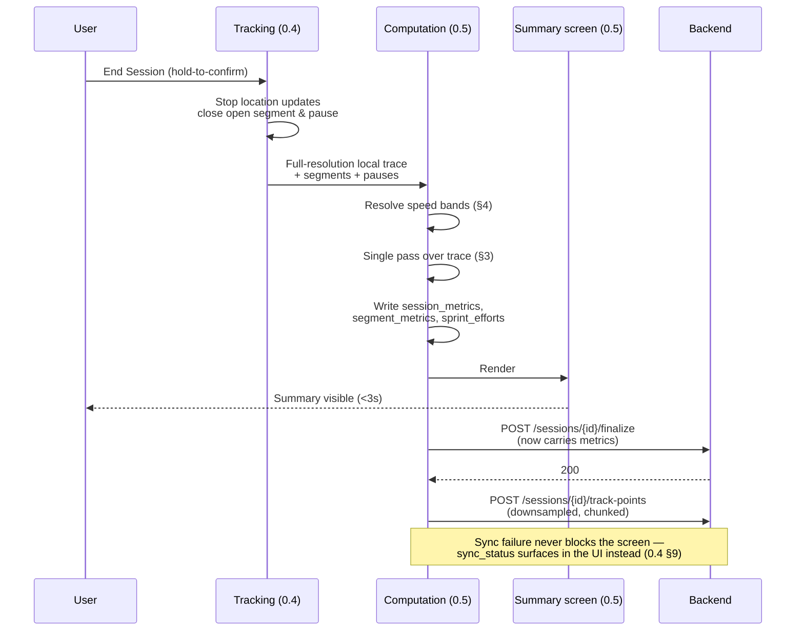
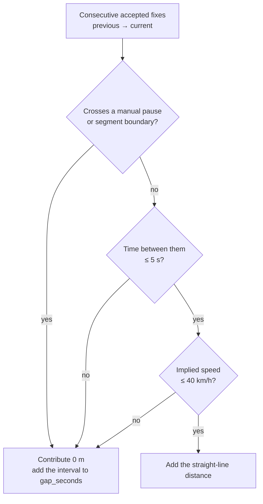
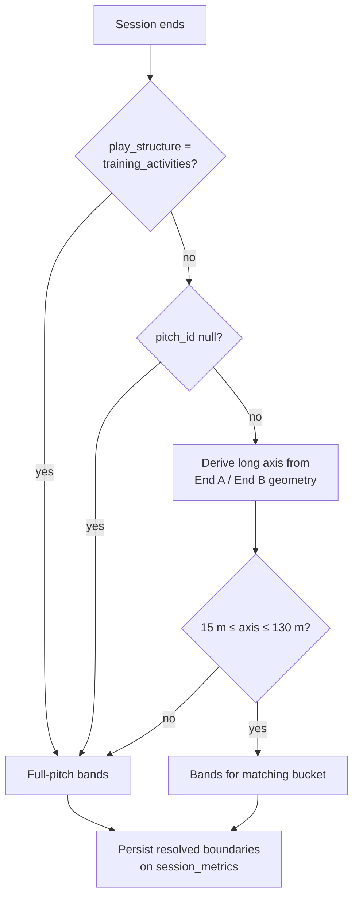
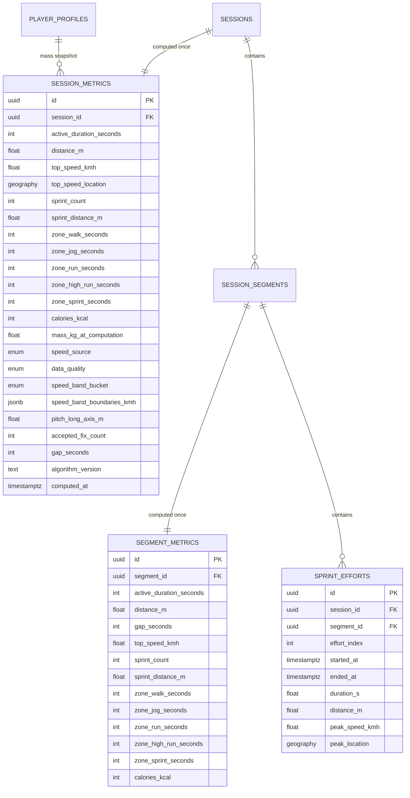
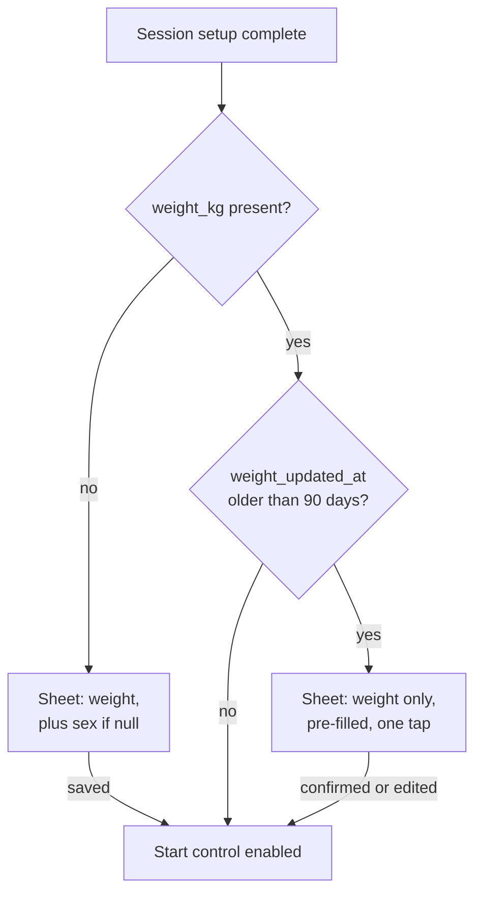

# Eleven — Post-Session Summary System Design Spec (Feature 0.5)

**Status:** Draft v2
**Milestone:** M0
**Feature:** 0.5 — Post-session summary
**Depends on:** 0.2 (player profile), 0.3 (session setup), 0.4 (GPS tracking), 0.4.2 (speed filtering)
**Contains amendments to:** 0.2 **[0.2]**, 0.3 **[0.3]**, 0.4 **[0.4 correction]**
**v2 changes:** session totals now stored on `session_metrics` (§6.1); segment-always invariant and its enforcement specified end to end (§7.3); `rejected` sync status added (§7.3.5); weight/sex offered optionally at signup as well as gated at session start (§7.1); weight staleness re-prompt via `weight_updated_at`, on one field-adaptive sheet (§7.2)

---

## 1. Scope

0.4 owns rawness — what the signal did, when tracking was and wasn't on. 0.5 owns **computation and the payoff screen**: turning that trace into the numbers a player actually sees.

**This spec owns:**
- The single on-device computation pass over 0.4's full-resolution local trace
- Every derived metric: active duration, distance, average speed, top speed, sprint efforts, speed zones, calories
- Pitch-scaled speed band resolution
- Data-quality classification and per-metric suppression
- The `session_metrics`, `segment_metrics`, and `sprint_efforts` tables
- The segment-always invariant that §3.2's duration formula depends on, and its enforcement across client, sync, and backend (§7.3)
- The post-session summary screen
- The `weight_kg` / `sex` profile fields **[0.2]** and the session-start gate that guarantees they exist **[0.3]**

**This spec does not own:**
- Point capture, accuracy filtering, pause semantics, or downsampling (0.4 §5, §4.2, §6)
- The speed filter chain itself (0.4.2) — 0.5 re-runs it, it doesn't define it
- Sync, retry, or the `finalize` transport (0.4 §8, §9)
- Session history (0.6), share cards (0.8), heatmaps (post-0.5)

**Explicitly out of scope for M0:**
- **Acceleration metrics.** The PRD implies accelerometer-based tracking; `session_track_points` captures no accelerometer data, and differencing `speed_kmh` at ~1 Hz produces an acceleration estimate too noisy to show anyone. Deferred rather than faked. The PRD line should be corrected to match.
- **Calorie backfill.** Sessions recorded before `weight_kg` exists get no calorie value, permanently.
- **Heart-rate-derived calories.** `sex` is collected now so the option exists later; nothing in M0 consumes it.
- **Cross-session aggregation** of any kind — that is 0.6's problem, with the caveat in §4.4.

---

## 2. Where computation sits in the lifecycle

Computation runs on-device at session end, **before** 0.4's sync step. This is what makes the sub-3-second render possible regardless of upload success, and it is the only place the full-resolution trace still exists.



**The trace is deleted only after `sync_status = synced` (0.4 §10), and metrics are written before that.** Consequence: once a session syncs, its metrics can never be recomputed — the input no longer exists, and the downsampled copy cannot reproduce them (0.4 §8.1 explains why for top speed; the same holds for sprint segmentation and time-in-zone). **Every metric in this spec is immutable by construction.** Any future metric must be computed here, now, or it will only ever exist for sessions recorded after it ships. This is the single most important constraint in this document.

That constraint is why §3 computes and stores sprint efforts and speed zones even though only five metrics are headlined: the marginal cost inside a pass that is already running is near zero, and the cost of adding them later is every session recorded in the meantime.

---

## 3. The computation pass

### 3.1 One pass, two binnings

A single iteration over the accepted fixes of the full-resolution local trace produces everything. Two binnings run concurrently over the same points:

| Binning | Boundaries | Feeds |
|---|---|---|
| **Display bands** | Pitch-scaled (§4) | Speed zones, sprint detection |
| **MET bins** | Fixed, absolute (§3.8) | Calories |

These must not be unified. Physiology does not know what size pitch you are on — 14 km/h costs the same energy whether the display calls it "sprint" on a futsal court or "run" on a full pitch. Tying calories to the relative bands would make identical effort burn different amounts depending on venue, which is invisible until a user compares two sessions and then permanently corrosive to trust in the number.

### 3.2 Active duration

**Active duration is the headline duration figure.**

```
segment_active_duration = (segment.ended_at − segment.started_at)
                          − Σ(manual pauses attached to that segment)

session_active_duration = Σ(segment_active_duration)
```

Three consequences worth stating explicitly, because each replaces an intuition that would produce a wrong number:

**Summing segments, not `ended_at − started_at` minus pauses.** The half-time break is the gap between segment 1's `ended_at` and segment 2's `started_at` — it is not a pause row and never will be, because tracking isn't inside a segment then. Summing segments excludes breaks automatically with no special case. An elapsed-minus-pauses formulation would include the break and need one.

**`planned_segment_length_minutes` never enters the calculation.** It is display-only — it drives the extra-time counter (0.4 §4.1) and the "planned length exceeded" indicator (0.3), nothing else. Added time is simply a segment running past its planned mark, so actual segment duration already contains it. Extra time is segments 3–4 by derivation (extensions spec §3.3) and needs no special handling either.

*Worked example.* Two halves planned at 30 minutes, 5 minutes added time in each, 10-minute break: segments run 35 and 35, the break is a gap between them, active duration is **70 minutes**.

**Only `manual` pauses subtract.**

| Pause reason | Subtracts from active duration? | Rationale |
|---|---|---|
| `manual` | **Yes** | The user told us they stopped. They probably walked off. |
| `gps_loss` | **No** | The player was on the pitch; we lost sight of them. Subtracting means someone who played a full 90 next to a stand reports 74 minutes, which is false and reads as a broken app. |
| `backgrounded` | **No** | Same category — a measurement failure, not an absence. |

The principle in one line: **subtract only when the player told us they stopped.** Everything else is measurement failure, and measurement failure belongs in the data-quality flag (§3.9), not in the duration.

`gps_loss` and `backgrounded` intervals contribute zero distance (no fixes exist) while counting toward duration. That asymmetry is intentional and is exactly what the `estimated` flag exists to explain.

### 3.3 Distance & gap handling

Distance accumulates as **geodesic** distance between consecutive **accepted** fixes — accepted meaning the fix cleared 0.4 §5's 20 m horizontal-accuracy filter.

**Geodesic means measured along the curved surface of the Earth, not across a flat plane.** It matters because fixes arrive as latitude/longitude in degrees, and degrees are not a uniform unit of length: one degree of latitude is about 111 km everywhere, but one degree of longitude shrinks toward the poles as `cos(latitude)` — roughly 111 km at the equator, 70 km at 51°N. Treating a pair of lat/lng points as flat *x* and *y* coordinates and measuring the straight line between them — `√(Δlat² + Δlng²)`, which is Pythagoras' theorem with the coordinate differences as the two short sides of a right triangle and the distance as the hypotenuse — therefore over-reports east-west movement almost everywhere, and by a factor that changes with where the pitch is. A session in Lagos and the same session in Manchester would measure differently for no reason but the phone's latitude.

**The fix is to scale the two axes correctly and then measure a straight line on a local plane.** Over the distances between consecutive fixes — metres, not kilometres — the Earth's curvature is irrelevant; what is not irrelevant is that a degree of latitude and a degree of longitude are different lengths, and both vary with where you are. Convert each axis to metres first and the flat-plane formula becomes correct:

```
metres per degree latitude  = M(φ) × π/180
metres per degree longitude = N(φ) × cos(φ) × π/180
```

`M` and `N` are the Earth's radii of curvature at latitude φ — `M` along a north-south line, `N` along east-west. They differ because the Earth is an ellipsoid; on a sphere they would be equal. Both come in closed form from two WGS84 constants:

```
a  = 6378137                 semi-major axis, metres
e² = 0.00669437999014        first eccentricity squared

W  = 1 − e²·sin²φ
N  = a / √W
M  = a(1 − e²) / W^(3/2)
```

**Compute both scale factors once per session**, from the pitch centroid — or the first accepted fix when `pitch_id` is null. Across a 120 m pitch they change in the seventh significant figure, far below GPS noise. Each fix pair then costs two multiplications and a square root, with no trigonometry in the loop:

```
Δnorth = (lat₂ − lat₁) × mPerDegLat
Δeast  = (lng₂ − lng₁) × mPerDegLng
metres = √(Δnorth² + Δeast²)
```

**Why not haversine.** Haversine computes great-circle distance on a sphere of fixed mean radius, usually 6 371 km. The Earth's local radius of curvature actually ranges from about 6 335 km to 6 400 km, so haversine carries a systematic scale error of a few tenths of a percent that varies with latitude — and, being systematic, it never averages out over a session. Near the equator the meridional radius is at its minimum, so the error is at its worst: at Lagos's latitude haversine over-reports north-south movement by roughly 0.55%, about 38 m on a 7 km session, always in the same direction. The local-plane method above is both more accurate and cheaper, because it uses the actual curvature at that latitude instead of a global average.

**The backend is ellipsoidal and will differ slightly.** PostGIS's `ST_Distance` over `geography` returns geodesic distance on the spheroid determined by the SRID, computed with GeographicLib (Karney's algorithm) since PostGIS 2.2 — not Vincenty, which it replaced for accuracy and convergence. Against the local-plane method the difference at these distances is negligible, but a client total and a server-side recomputation agreeing only to the last decimal place is expected, not a bug.

**One shared implementation.** The formula currently exists twice in the client, in `live-metrics.ts` and `speed-filter.ts`, with the tests approximating it a third way. All three should call one function. F3's position cross-check (0.4.2) is unaffected by the change either way — it compares a ratio against a 50% gate, which a sub-percent shift cannot flip — but two copies of a distance function is a divergence waiting to happen.

Accumulate the running total in a 64-bit float. Summing several thousand small distances in 32-bit precision loses resolution in exactly the place it matters.

#### What a gap is

Tracking aims for roughly one accepted fix per second, so consecutive fixes are normally about a second and a few metres apart. A **gap** is any pair that is further apart than that. Gaps come from three places, and they look identical in the data even though they mean completely different things:

1. **Pause intervals**, manual or auto. The player may resume 40 m away at the other end of the pitch, or after driving home.
2. **Auto-pause windows.** `gps_loss` opens after 30 s without an accepted fix, leaving a hole before the pause opens and another before it resumes; `backgrounded` opens immediately when the app is suspended without background permission.
3. **Rejected fixes mid-play.** Anything over 20 m horizontal accuracy never becomes an accepted fix (0.4 §5), so two consecutive *accepted* fixes can be 8 seconds and 60 metres apart while the player never left the pitch.

#### The decision, and why it isn't obvious

For each consecutive pair of accepted fixes, the loop either adds the straight-line distance between them or adds nothing. Both choices are wrong some of the time:

- **Always bridge** and you invent distance. A player who paused, drove 6 km home and forgot to end the session gets 6 km of "running" from one pair of fixes.
- **Never bridge** and you lose real distance. A three-second cluster of rejected fixes mid-sprint is 25 m of genuine movement that silently disappears.

Straight-line bridging also degrades as the gap widens, independently of whether the player was really moving. Over one second a path is effectively straight, so the straight line is an excellent estimate. Over forty seconds the player has changed direction several times, and the straight line between the endpoints measures the *displacement* rather than the *distance travelled* — under-reporting badly, and worst of all for the player who ran hardest during the hole.

So the rule is a three-part test, applied in order.



**Test 1 — boundaries. Never bridge, whatever the interval.** If a **`manual` pause** or a **segment boundary** sits between the two fixes, the pair contributes zero. This is the one part of §3.3 that is not a tuning decision: the player told us they stopped, or the session moved between segments, and in both cases nothing is known about where they went or for how long. A half-time break where the player walks to the car and back would otherwise contribute a straight line across the car park.

Applied first because it is the cheapest test and the only unconditional one.

**Auto-pauses are not boundaries.** `gps_loss` and `backgrounded` are measurement failures, not statements that the player stopped — the same distinction §3.2 uses to decide which pauses subtract from active duration. A pair spanning one of them falls through to Tests 2 and 3 like any other gap. In practice:

| Pause reason | Effect on distance |
|---|---|
| `manual` | Never bridged — Test 1 |
| `gps_loss` | Falls through, but always fails Test 2 in practice: the auto-pause only opens after 30 s without an accepted fix, so the fixes either side are more than 30 s apart by construction |
| `backgrounded` | Falls through and often bridges. This pause opens immediately rather than after 30 s, so someone checking a notification for three seconds mid-match produces a short gap that both remaining tests accept — correctly, since they were on the pitch throughout. A long backgrounded window still fails Test 2. |

**Segment boundaries stay unconditional** for a second reason beyond the break being untracked: a pair spanning two segments has no unambiguous home in `segment_metrics`. Even a user who starts the second half two seconds after ending the first should not produce a distance contribution belonging to neither segment.

**Test 2 — interval. Bridge only up to 5 seconds.** Within five seconds a player covers about 7 m walking or 28 m sprinting, and the path is close enough to straight that the straight line is a good estimate of it. Beyond that the estimate degrades for the reason above, so the pair contributes zero and the interval is recorded as uncovered instead of guessed at.

This is the test that handles source 3 — brief clusters of rejected fixes are bridged, longer dropouts are not.

**Test 3 — implied speed. Reject anything over 40 km/h.** Divide the straight-line distance by the interval: two fixes three seconds and 60 m apart imply 72 km/h, which no footballer produces. That is a GPS position jump — a reflected signal or a bad fix that cleared the accuracy filter — and bridging it would add 60 m of movement that never happened.

The 40 km/h ceiling is 0.4.2's F2, reused deliberately. A value that is implausible as a *speed* is equally implausible as *distance covered*, and using one number for both means there is one place to retune rather than two that can drift apart.

#### What happens to the time that isn't bridged

Every skipped interval accumulates into `gap_seconds`, on both the segment and session records. It does two jobs: it is the primary input to §3.9's data-quality classification, and it makes covered time recoverable later as `active_duration_seconds − gap_seconds` without needing the raw trace.

#### The net effect

**Distance is deliberately biased low.** Every one of these tests, when it fires, drops real movement along with the phantom kind — there is no way to tell them apart from two fixes alone. The alternative bias would be a distance figure that quietly inflates whenever signal degrades, which is exactly the number a player would screenshot and exactly the one that would be wrong.

The under-reporting is *measured* rather than hidden, which is what makes it acceptable: `gap_seconds` says how much time went unaccounted for, §3.9 turns that into an `estimated` flag, and the player is told the figure is conservative rather than being shown a confident wrong number.

### 3.4 Average speed

```
average_speed_kmh = distance_km ÷ (active_duration_seconds ÷ 3600)
```

The alternative considered was dividing by *covered* time — excluding signal-loss windows — which is more accurate, since those windows contribute duration but no distance.

**Rejected deliberately.** It produces a screen where three displayed numbers do not reconcile: on a session with a 6-minute signal drop, 7.2 km over 70 minutes reads as 6.2 km/h while the card shows 6.8. Nothing is wrong, and there is no way for the user to work out why. "The maths on my own stats doesn't add up" looks like a bug, not a nuance, and costs more trust than the ~7% depression it would have fixed on a metric nobody screenshots. Self-consistent and slightly conservative beats accurate and unexplainable — and the `estimated` flag already exists to carry the explanation.

### 3.5 Top speed

0.5 re-runs 0.4.2's full four-filter chain over the complete trace rather than accepting 0.4's live HUD value. Rationale is in 0.4.2 §5: batch has full look-ahead, live does not, so this pass is strictly better-informed and costs nothing inside an iteration already happening.

Per 0.4.2 §8, **the peak fix's location is copied onto `session_metrics` at the moment the peak is confirmed**, not looked up in the synced trace afterward. This decouples any future "where on the pitch" feature from downsampling behaviour entirely.

### 3.6 Sprint detection

A sprint effort is a window satisfying **all** of:

| Condition | Value | Why |
|---|---|---|
| Speed above the session's **sprint boundary** | §4.2 — the last column of the band table, resolved from pitch size: 15 km/h futsal, 17 small-sided, 18 mid, 20 full pitch | Sprint is not one number; it scales with how much room the player had (§4.1) |
| Spanning ≥ 1.0 s | | Physiologically the floor for a real burst |
| Across ≥ 2 consecutive accepted fixes | | At ~1 Hz a duration test alone can be satisfied by a single noisy reading bracketed by timestamps. Same reasoning as 0.4.2 F4's fix floor. |
| Displacement ≥ 5 m | | Guards against speed-field noise producing a zero-displacement "sprint" |

#### Merging: one run is one sprint

**Two qualifying windows separated by less than 1.0 s below the boundary are one effort, not two.**

GPS speed carries roughly ±1–2 km/h of noise, and a real sprint is not a flat line either — the player adjusts stride, changes direction, checks their run. So anyone sprinting *near* the boundary crosses back over it repeatedly during one continuous effort. Against a 17 km/h boundary, a single five-second run can read:

```
t0   17.8 km/h    above
t1   18.9          above
t2   16.7          below     ← one noisy sample
t3   19.2          above
t4   18.4          above
```

Without merging that is two sprints: one run counted twice because of a single reading.

The merged effort spans from the start of the first window to the end of the last, dip included, so its distance, duration and peak speed describe the whole run. That matters for longest-sprint, which ranks by distance — two halves of one run would each lose to a shorter but cleaner sprint.

**Why 1.0 s.** It is shorter than any real recovery: a player who genuinely stops sprinting and starts again takes several seconds. So a sub-second dip is within-run variation or sensor noise, never two efforts. A true sprint–jog–sprint with three seconds between still counts as two, correctly.

**Merging chains, with a cap.** Three windows separated by two sub-second dips are **one** effort, not two — absorb left to right while each gap is under 1.0 s. A pairwise-only implementation would merge the first two and leave the third separate, reproducing the same bug one dip later.

```
above 2.4s | 0.8s below | above 1.1s | 0.6s below | above 3.0s
└───────────────── one effort, 7.9 s ─────────────────┘
```

Unbounded chaining fails the other way: a player hovering at the boundary dips briefly every few seconds and chains into a single minute-long "sprint" that would dominate longest-sprint permanently. So **cumulative below-threshold time within one merged effort is capped at 2.0 s** — when absorbing the next gap would exceed it, close the effort and start a new one. Individual dips stay under 1.0 s; the cap limits how many accumulate.

**What breaks without merging** is worse than an inflated count. The metric stops measuring effort and starts measuring *proximity to the boundary*. A player sprinting at 25 km/h is comfortably clear of a 17 km/h threshold and never dips, so their count is clean; a player sprinting at 17.5 km/h straddles it constantly and gets an inflated count — for running **slower**. The number would reward being near the line, which is a property of the measurement rather than of the football.

**Sprint detection applies 0.4.2's F1 and F2 only — not F3 or F4.** F1 (speed accuracy) and F2 (40 km/h ceiling) prevent a noise spike fabricating a sprint and belong here. **F4's ≥ 3 s sustain must not apply**: it exists to make a *record* trustworthy, and a genuine 1.5-second burst is a real sprint that F4 would silently discard. Reusing the chain wholesale — the obvious move, since "we already have a speed filter" — would under-count every sprint in the app with no visible failure. F3's position-delta cross-check is optional here and omitted for simplicity; F1 and F2 carry the load.

Every effort is stored as a row (§6.3), not just the best one per segment. Count, longest, and total sprint distance all derive from the table.

**Longest sprint is ranked by distance, with both figures displayed** — "Longest sprint — 38 m over 4.2 s". The longest-by-duration effort is frequently not the longest-by-distance one, so a single "longest sprint" label showing both numbers could otherwise be silently describing two different sprints. Distance is the more intuitive ranking axis and the one players talk about. Both values are on every row, so 0.6/0.8 can rank differently later without recomputation.

### 3.7 Speed zones

**Zone seconds** are how long the player spent in each of the five display bands (§4.2). Each fix is assigned to the band its speed falls in and contributes the interval until the next accepted fix, producing five counters per segment — `zone_walk_seconds`, `zone_jog_seconds`, `zone_run_seconds`, `zone_high_run_seconds`, `zone_sprint_seconds` (§6).

This is the shape of a session rather than its size. Two players with identical 8 km sessions can have completely different zone profiles, and that difference is what the breakdown exists to show.

**Intervals excluded from distance under §3.3 are excluded from zone totals too.** Otherwise a 40-second signal drop dumps 40 seconds into whichever band the last fix happened to occupy — usually inflating a high band, because sprints are exactly when signal degrades.

### 3.8 Calories

Zone-weighted MET, summed over time in **fixed** bins:

```
kcal = Σ over bins [ MET_bin × 3.5 × mass_kg ÷ 200 × minutes_in_bin ]
```

| Speed (km/h) | MET |
|---|---|
| < 5 | 2.5 |
| 5 – 7 | 3.5 |
| 7 – 10 | 8.0 |
| 10 – 13 | 11.0 |
| 13 – 16 | 13.0 |
| 16 – 19 | 15.5 |
| ≥ 19 | 19.0 |

`mass_kg` comes from `player_profiles.weight_kg` and is **snapshotted onto `session_metrics` as `mass_kg_at_computation`**. Weight changes; metrics are immutable; a figure from six months ago must stay explainable.

`sex` is captured (§7.1) but consumed by nothing in M0. It exists so an HR-derived model (Keytel et al., which needs age, sex, mass, and heart rate) remains available if wearable support arrives. `prefer_not_to_say` must never block computation — the MET model does not use it.

Because the session-start gate (§7.2) guarantees weight exists, **`calories_kcal` is never null for any session recorded after 0.5 ships.** Sessions recorded before it are not backfilled.

### 3.9 Data quality

Two inputs, both produced by the same pass:

- **Gap fraction** = `gap_seconds ÷ active_duration_seconds`
- **Acceptance rate** = `accepted_fix_count ÷ active_duration_seconds` — approximately 1.0 for a clean 1 Hz session

| Flag | Condition |
|---|---|
| `good` | gap ≤ 5% **and** acceptance ≥ 0.7 |
| `estimated` | gap 5–25%, **or** acceptance 0.4–0.7 |
| `insufficient` | gap > 25%, **or** acceptance < 0.4, **or** < 120 accepted fixes, **or** active duration < 2 min |

`insufficient` is not a badge on a set of numbers — it is a different screen (§5.2).

---

## 4. Pitch-scaled speed bands

### 4.1 Why the bands move

An absolute 20 km/h sprint threshold is standard in team-sport GPS and wrong for this product. On a 40 × 20 m futsal court nobody reaches it, so the sprint count reads zero forever — and a metric that is always zero is worse than no metric, because it looks broken rather than absent. Small-sided football is a large share of how the target user actually plays.

**Bucketing is on long-axis length, not area.** Two pitches of equal area — one long and narrow, one square — afford completely different top-end running, because sprinting happens along the longest available straight line. Long axis is derived from 0.3's End A / End B geometry.

**Buckets, not a continuous scaling function.** Pitch corners are walked and marked by a user on a phone; the geometry is approximate by nature. A bucket boundary tolerates a corner dropped ten metres off; a continuous function shifts every threshold in response to that same error.

### 4.2 Band table

All values km/h.

| Bucket | Long axis | Walk | Jog | Run | High run | Sprint |
|---|---|---|---|---|---|---|
| Futsal / small-sided | < 45 m | < 7 | 7 – 9 | 9 – 12 | 12 – 15 | ≥ 15 |
| Small (7-a-side) | 45 – 65 m | < 7 | 7 – 10 | 10 – 14 | 14 – 17 | ≥ 17 |
| Mid (9-a-side) | 65 – 85 m | < 7 | 7 – 11 | 11 – 15 | 15 – 18 | ≥ 18 |
| Full (11-a-side) | ≥ 85 m | < 7 | 7 – 12 | 12 – 16 | 16 – 20 | ≥ 20 |

**The walk boundary does not scale.** A person walks at roughly 5 km/h regardless of venue. Scaling it down with the rest would have ordinary walking register as jogging on a futsal court.

All three upper boundaries move together as one set, so the bands stay contiguous — moving only the sprint threshold would open a gap or an overlap against "high run" and make the zone chart incoherent.

### 4.3 Resolution & precedence



**`training_activities` always uses full-pitch bands, regardless of any attached pitch.** If you are running drills or laps, the pitch dimensions are not what bounds your movement. A training session can still have a pitch attached (extensions spec §4.4), so the rule has to be stated rather than inferred.

**The sanity clamp matters more than it looks.** A user who marks both ends at nearly the same spot, or taps through pitch marking carelessly, produces a degenerate long axis. Falling back to full-pitch bands is the conservative failure — it under-counts sprints rather than reporting dozens of phantom ones.

### 4.4 What this trades away

**Sprint counts stop being comparable across venues.** Twelve sprints on futsal and twelve on a full pitch are no longer the same claim. This directly affects 0.6's history list and 0.8's share card, and any future "sprints this month" aggregate would be summing incomparable units.

Accepted deliberately — a comparable-but-always-zero metric is worth less than an incomparable-but-live one — with two mitigations:

1. **The resolved boundaries are persisted per session** (`speed_band_boundaries_kmh`, §6.2), not just the bucket name. Thresholds are unvalidated (§8) and will be retuned; without the actual numbers on the row, retuning silently reinterprets every historical session.
2. **The threshold is shown in the UI** — "12 sprints above 17 km/h", not a bare "12 sprints". Consistent with the honesty posture elsewhere, and it answers "why did I get more sprints last week?" before it is asked.

**Flagged for 0.6:** any cross-session sprint aggregate needs a stated rule — group by bucket, normalise, or refuse. Do not sum blindly.

---

## 5. Missing & degraded data

### 5.1 When `speed_kmh` is unavailable

`session_track_points.speed_kmh` is nullable. Sprint detection, zones, top speed, and calories all depend on it.

**Fallback order,** recorded as `speed_source` on `session_metrics`:

| `speed_source` | Meaning |
|---|---|
| `os` | OS-provided speed field used (0.4 §5, the normal case) |
| `position_delta` | OS speed absent; speed derived from consecutive accepted-fix displacement |
| `none` | Neither available — fixes too sparse or positions unusable |

Under `none`, metrics are suppressed **per-metric, not per-session**:

| Still shown | Suppressed |
|---|---|
| Distance | Top speed |
| Active duration | Sprint count / longest sprint / sprint distance |
| Average speed (distance ÷ duration — needs no speed field) | Speed zones |
| Calories, via distance fallback ≈ 1.0 kcal per kg per km, flagged `estimated` | |

One plain-language explanation, once, near the suppressed metrics:

> Your phone didn't record speed during this session, so we couldn't work out your top speed or sprints. Your distance and time are still accurate.

It names the limit, says what remains trustworthy, and blames neither the user nor a vague "GPS issue". A session with real distance and duration is worth keeping; it should not be thrown into a whole-session error state over one missing field.

### 5.2 `insufficient` sessions

When §3.9 returns `insufficient`, the screen shows a "we couldn't track this one properly" state rather than a grid of numbers with an asterisk. The session is still stored and still syncs — history should show it existed — but presenting metrics derived from 30 seconds of usable signal as though they were measurements is precisely the failure this spec's honesty requirements exist to prevent.

### 5.3 Summary screen requirements

**Renders within 3 seconds** of End Session, from the local record, never blocking on sync.

**The summary screen shows:**

| Element | Source | Notes |
|---|---|---|
| Five headline metrics — distance, duration, top speed, sprint count, calories | `session_metrics` | Explicit units (km, min, km/h, count, kcal). Duration is **active** duration (§3.2) |
| Sprint threshold caption | `speed_band_boundaries_kmh` | "14 sprints above 17 km/h · 7-a-side bands" — required by §4.4, not optional garnish |
| Speed-zone bar | `zone_*_seconds` | The five bands as proportions. This is what makes the threshold caption legible — see below |
| Per-half / per-activity breakdown | `segment_metrics` | Distance and zones per segment. The only surface that pays off §6.1's segment table |
| `estimated` indication, per metric | §3.9, §5.1 | Per-metric, not a whole-session badge |
| Sync state | 0.4 §9, §7.3.5 | A queued session must not imply it is on the server; a `rejected` one must not imply it is still trying |

**Speed zones ship with 0.5**, despite not being among the PRD's five. They are computed and stored regardless (§3.7), so rendering them costs one component and no computation. The stronger reason is that §4.4 requires showing the sprint threshold, and a bare "above 17 km/h" is close to uninterpretable on its own — the zone bar is what shows where that threshold sits relative to everything else the player did.

**Sprint detail drill-down**, opened from the summary: the `sprint_efforts` rows as a **list** — rank, distance, duration, peak speed. This is a read of rows that already exist, with no new computation or API, and it is the only surface that justifies storing every effort rather than one per segment (§6.3).

**The drill-down renders no pitch-space visual.** Plotting sprints onto pitch geometry needs the same point-reflection normalisation against End A/End B that heatmaps need (0.4 §11), and that machinery is deferred as a whole. The line is clean: **0.5 ships everything that can be drawn without pitch geometry; everything drawn in pitch space waits and ships together.**

**Not on this screen:** heatmap (§10 — reads the synced trace later, no reason to build now), any pitch-space rendering, and average speed (a 0.7 weekly-rollup metric, computed here but not displayed).

**No tab chrome.** Session detail is a single view in M0. Tabs arrive with the second view.

Share (0.8) and View History (0.6) affordances are present but **both dead-end in M0** — visibly disabled or absent rather than navigating to a stub, since a dead tap reads worse than a missing button.

---

## 6. Data model



### 6.1 Why two tables, and why totals are stored in both

**`segment_metrics` exists because of immutability (§2).** Per-half and per-activity numbers are either computed in the end-of-session pass or lost for that session permanently. They carry real football meaning — a second-half fade in distance, how much of a training session was the run versus the drills, extra time as its own load figure — and the active-session screen already shows the closed segment's distance live at every segment switch. A summary that could only show session totals would take away numbers the player saw thirty seconds earlier.

**Session totals are stored on `session_metrics` as well, not derived by summing segment rows.** Every summable figure — active duration, distance, sprint count and distance, per-zone time, calories, gap seconds — exists on both tables.

This looks like a violation of derive-don't-store, and it is worth being precise about why it isn't. That principle earns its keep for state that must be kept in sync with something **mutable**: extra-time phase is derived from `segment_index` because a stored phase column could drift as segments are added. These rows are different. They are written **once**, from **one pass**, and never updated. There is no later write that could desynchronise a total from its parts — the only way they disagree is a computation bug at write time, and §9's coherence check catches exactly that at ingest.

With the drift risk gone, what remains is a trade between redundancy and read shape. Stored totals give 0.6's history list a flat read instead of a `GROUP BY` over segments on every page. That wins.

**Average speed is the one headline figure not stored anywhere** — it is a single division of two stored fields, not an aggregation, and storing it would be redundancy with no read benefit.

**Per-segment sprint breakdowns come free from `sprint_efforts.segment_id`**, independently of `segment_metrics`.

### 6.2 `algorithm_version` and `speed_band_boundaries_kmh`

Both exist for the same reason. Every tuning value in this spec is a reasoned guess (§8), metrics are immutable, and retuning is expected. Without a version string on the row you cannot tell which sessions were computed under which parameters; without the resolved boundaries you cannot interpret a historical zone breakdown after the bands move. Two small columns that make the whole store self-describing.

#### Version registry

`algorithm_version` is a short opaque string, `v1`, `v2`, … A single client constant is its only source; nothing derives it from a build number or a date.

**Bump the version when the same input trace would produce a different stored value.** That covers any change to the band table, sprint or merge rules, gap-bridging rules, MET values or bins, the distance method, and the data-quality thresholds. It does not cover refactors that leave output identical, or anything purely presentational. Over-bumping costs nothing; under-bumping makes a mixed store unreadable, so err toward bumping.

The registry below is the historical record and is **append-only** — entries are never edited once shipped, even when §8 is retuned. §8 always shows current values; the registry shows what each past version actually used.

**`v1` — initial release with Feature 0.5**

| Area | Definition |
|---|---|
| Distance | Local tangent plane with WGS84 per-latitude scale factors, computed once per session (§3.3) |
| Gap bridging | No bridge across `manual` pauses or segment boundaries; otherwise ≤ 5 s interval and ≤ 40 km/h implied speed (§3.3) |
| Active duration | Σ segment durations − `manual` pauses only (§3.2) |
| Speed bands | Pitch-scaled, four buckets on long axis: sprint boundary 15 / 17 / 18 / 20 km/h; walk boundary fixed at 7 km/h (§4.2) |
| Bucket resolution | Long axis 15–130 m, else full-pitch bands; `training_activities` and null `pitch_id` always full-pitch (§4.3) |
| Sprint detection | Above the session's sprint boundary, ≥ 1.0 s across ≥ 2 accepted fixes, ≥ 5 m displacement; 0.4.2 F1 + F2 only (§3.6) |
| Sprint merging | Transitive, gaps < 1.0 s, cumulative below-threshold cap 2.0 s per effort (§3.6) |
| Top speed | Full 0.4.2 F1–F4 chain re-run in batch (§3.5) |
| Calories | Zone-weighted MET on fixed absolute bins, 2.5 / 3.5 / 8.0 / 11.0 / 13.0 / 15.5 / 19.0 (§3.8) |
| Calorie fallback | ≈ 1.0 kcal per kg per km when `speed_source = none` (§5.1) |
| Data quality | `good` ≤ 5% gap and ≥ 0.7 acceptance; `insufficient` > 25% gap, < 0.4 acceptance, < 120 fixes, or < 2 min active (§3.9) |

**The backend stores the version as given and never rejects an unknown one.** Clients update on their own schedule, so a `v2` client will be writing while `v1` clients are still in the field. Validating against a server-side allowlist would reject real sessions from users who updated early — exactly the sessions most worth keeping.

### 6.3 `sprint_efforts` supersedes 0.4 §11

0.4 §11 describes `sprint_efforts` as *"capped at one per segment — effectively 'top speed per segment'"*. **That is superseded here.** Every detected effort is a row. A 90-minute match produces perhaps 20–30 rows, which is negligible beside track-point volume, and it is the only structure from which count, longest, total distance, and future top-N leaderboards can all derive. The one-per-segment cap would have made three of those four impossible and, given §2's immutability constraint, impossible retroactively.

---

## 7. Amendments to earlier specs

Both sections live here rather than in a standalone amendment document: unlike the session-structure extensions, neither stands on its own rationale. `weight_kg` exists *only* because 0.5 computes calories, and the gate exists *only* to guarantee it is populated. A separate document would be two sections whose entire justification is "because 0.5", read by someone already reading 0.5.

**Both base specs need a cross-reference line pointing here**, or the profile spec's field table stays quietly incomplete for the next reader.

### 7.1 Profile schema **[0.2]**

Added to `player_profiles`:

| Column | Type | Notes |
|---|---|---|
| `weight_kg` | numeric(4,1), nullable | Positive and at most 999.9 at the Pydantic layer. The column width is the limit; there is no body-size range |
| `sex` | enum: `male`, `female`, `prefer_not_to_say`, nullable | |
| `weight_updated_at` | timestamptz, nullable | Set on every write to `weight_kg`. Drives the staleness re-prompt (§7.2) |

**The field is `sex`, not `gender`.** It is a physiological input to an energy-expenditure formula. Conflating it with gender identity makes the field wrong for its stated purpose and the UI copy dishonest. The onboarding copy should say what it is for.

`prefer_not_to_say` satisfies the gate and blocks nothing — the MET model in §3.8 does not consume `sex` at all.

Both fields are private: excluded from `ProfileReadPublic`, present in `ProfileRead`.

**Both are reachable at three points, and the distinction between them is the design:**

| Point | Behaviour |
|---|---|
| Onboarding profile setup (0.2) | **Offered, skippable** — alongside `height_cm`, which they sit naturally beside |
| Session start (§7.2) | **Hard gate** on `weight_kg`, if still null |
| Profile settings (0.2) | **Editable at any time**, like every other profile field |
| Staleness re-prompt (§7.2) | Pre-filled confirm sheet at session start when the saved weight is over 90 days old |

Weight changes over months and years, so profile settings must allow editing it rather than treating it as write-once. Editing it changes nothing about past sessions: §3.8 snapshots `mass_kg_at_computation` onto each session's metrics, and those are immutable (§2). A session's calorie figure stays the one that was correct on the day it was recorded, which is the behaviour a user would want if they thought about it — but it is also the kind of thing worth a one-line note near the weight field rather than leaving someone to wonder why their history didn't shift.

Offering at signup costs nothing and is the earliest possible capture. Because there is no backfill (§1), every session a user records before entering their weight loses its calorie figure permanently — so the earliest chance to ask is worth taking, even if most people skip it. Keeping it skippable there is what preserves the funnel argument in §7.2: the ask is present but never blocks anyone from finishing signup.

### 7.2 Session-start gate **[0.3]**

A blocking sheet on the 0.3 session-setup screen, before the Start control, in two cases: `weight_kg` is null, or it is stale.

**One sheet component, with its field set computed from profile state** — not two separate sheets. The two cases share a position in the flow, a dismissal rule, and a copy scaffold; duplicating them into separate screens means two things to keep in step and two places for the copy to drift.

| Profile state | Fields rendered | Sheet reads as |
|---|---|---|
| `weight_kg` null, `sex` null | Weight + sex, both empty | First-time setup |
| `weight_kg` null, `sex` set | Weight only, empty | First-time setup |
| `weight_kg` stale | Weight only, **pre-filled** | Confirmation — one tap |

**Sex never appears in a staleness prompt.** It does not drift, so there is nothing to re-confirm; asking again would make a one-tap confirmation into a form and undo the point of §7.2's staleness reasoning.



**Sex is never a blocker.** Nothing in M0 consumes it (§3.8), so a user who leaves it empty at the first-time gate passes through, and it stays null until they set it in profile settings. The gate blocks on `weight_kg` alone.

**Why the hard gate is here rather than at signup.** The fields are offered at signup (§7.1); what is deliberately *not* at signup is the block. M0's bar is habit formation, and a hard gate at the widest point of the funnel is friction spent on the metric players care about least. Asking someone standing on a pitch about to play is a far easier ask than asking someone who just installed the app — at that moment the reason is self-evident, and they have already decided to use the product.

**Copy must state the reason** ("we need your weight to estimate calories"), not present a bare form.

**This is a hard block, chosen deliberately.** The alternative — skip and forfeit calories for that session — is gentler but, given no backfill, produces permanently incomplete sessions and breaks the "never null after 0.5" invariant in §3.8. One field, once, at a moment when the reason is obvious, is judged the better trade. It is the single point in the app where the user is most time-pressured, so the sheet must be one screen and fast.

Existing users are prompted through this same gate. No separate migration campaign is needed — anyone who starts a session gets asked, and anyone who opens profile settings can fill it in there first.

#### Staleness re-prompt

`player_profiles` gains **`weight_updated_at`** (timestamptz, set on every write to `weight_kg`). When it is older than **90 days** at session start, the same sheet appears pre-filled with the current value: one tap to confirm, or edit and save. Confirming without changing the value still refreshes `weight_updated_at`, so the prompt does not return next session.

Weight drifts over months while sessions happen weekly, so §3.8's `mass_kg_at_computation` snapshot slowly detaches from reality if nobody ever asks again. A null check alone catches the user who never entered a weight; it never catches the user whose weight was right two years ago.

**Confirming at every session was considered and rejected.** The answer would be "unchanged" nearly every time, which teaches people to dismiss the sheet without reading it — so on the one occasion the number is genuinely wrong, they tap straight past it, and the prompt stops doing the job it was added for. It also spends the most time-pressured moment in the app on a recurring no-op: the one-time gate above is affordable precisely because it is once. And the accuracy on offer is modest — calories scale linearly with mass, so being 3 kg stale on 75 kg is roughly a 4% error on a MET estimate already carrying ±20–30% against reality. Recurring friction to tighten a figure the model cannot resolve that finely is a bad trade.

A null `weight_kg` is simply the degenerate case of infinite staleness, which is why both triggers share one sheet rather than becoming two flows.

### 7.3 Segments always exist — invariant & enforcement **[0.4 correction]**

**The invariant:** every pause and every track point belongs to a segment. There is no session-level pause and no segmentless point.

`open` was the only structure without segments, and it is gone: renamed to `training_activities` (extensions spec §4.1), which creates one segment per activity (extensions spec §4.3). §3.2's active-duration formula sums segments and depends on this invariant holding. So does the backend, which already refuses to accept anything else.

The problem is that the invariant is currently enforced **only at the backend**, which is the worst place for it to be the sole check. A violation is discovered at sync, after the session is over, when it can no longer be corrected — and it is discovered as a 422, which no amount of retrying fixes.

#### 7.3.1 The live failure path

`endCurrentActivity` closes the open pause, closes the segment, and sets `current_segment_id = null` with `tracking_status = 'live'`. That is the break state — the "Swapped ends?" screen, between one segment closing and the next being started. It is correct, and §3.2 relies on it: the break is not inside any segment, so it is excluded from active duration automatically.

Three code paths create pauses. They do not all respect that state:

| Path | Guard on an open segment? | Outcome during the break |
|---|---|---|
| `processLocationUpdate` → `startAutoPause` (`gps_loss`) | **Yes** — returns early on `!inActivity` (`current_segment_id != null`) | Safe |
| `processLocationUpdate` → `insertTrackPoint` | **Yes** — `canInsert` requires `inActivity` | Safe |
| `handleAppBackgrounded` (`backgrounded`) | **No** — checks only `tracking_status === 'live'`, which is true during the break | **Orphan pause** |
| `startManualPause` (`manual`) | **No** | Orphan pause, if the control is reachable from the break screen |

The `backgrounded` row is not hypothetical. On iOS under When-In-Use permission, a player who locks their phone at half-time — which is close to the default thing to do at half-time — writes a pause with `segment_id = null`. At sync, `segmentIndexFor` maps it to `segment_index: null`, `_validate_pauses` rejects the finalize with a 422, and the session enters `failed`. It then retries under exponential backoff indefinitely (0.4 §10), and every retry is rejected identically. The session's metrics and its entire trace never reach the server, and the full-resolution trace is never deleted because `synced` is never reached.

#### 7.3.2 Enforcement at write time — primary

The fix belongs at the point of creation, and the strongest form of it is a **type**, not a runtime check:

- `insertPause` and `insertTrackPoint` take `segmentId: string`, not `string | null`. Calling either without an open segment becomes a compile error, so the next code path that creates a pause cannot reintroduce the bug by forgetting a guard.
- `TrackingPauseRow.segment_id` and `TrackingPointRow.segment_id` become `string`.
- The local SQLite columns `tracking_pauses.segment_id` and `tracking_points.segment_id` become `NOT NULL`, so the database refuses a violation even from a path that bypasses the typed helpers.
- `handleAppBackgrounded` and `startManualPause` return early when `current_segment_id` is null. For `backgrounded` this is the correct behaviour, not merely a safe one: nothing is being tracked during the break, so there is nothing to pause. The player must foreground the app to start the next segment anyway.
- `startAutoPause`'s `segmentId` parameter narrows to `string`. Its caller is already guarded; the type makes that guard load-bearing rather than incidental.

#### 7.3.3 Segment close closes the open pause, at the same instant

A pause open when a segment closes — signal lost in the last minute of a half, or a manual pause the user never resumed before tapping the half switch — must close with it. Otherwise its interval runs past its segment's `ended_at`, and `_validate_pauses` rejects it for falling outside the segment window: the same unfixable 422 by a different route.

`endCurrentActivity` already calls `closeOpenPause` before `closeSegment`, which is correct. Two tightenings:

- **Pass one shared timestamp to both.** Each currently defaults to its own `new Date()`. The ordering happens to keep the pause inside the window today, but that correctness depends on call order rather than being structural. One `closedAt`, passed to both, makes it structural.
- **End Session follows the same rule** (0.4 §9 already requires closing any open pause locally), with the same shared timestamp.

#### 7.3.4 Sync-time backstop — secondary

With §7.3.2 in place, an orphan pause should not be able to exist. The backstop exists for rows written by builds that predate the fix, and for whatever path nobody has thought of yet.

`segmentIndexFor` no longer returns null. A pause whose segment cannot be resolved is **dropped from the finalize payload and logged**, rather than sent.

Dropping is correct, not merely convenient. An orphan pause sits between segments — inside a break that §3.2 has already excluded from active duration. The computation never used it. Removing it from the payload makes the server's record *more* consistent with the metrics the client computed, not less. The alternative — sending it and letting the backend reject the whole session — trades one meaningless row for every metric and every point in the session.

The same rule applies to track points: a point that cannot resolve a segment is dropped from the upload.

#### 7.3.5 Non-retryable rejection **[0.4 correction]**

0.4 §9 retries every failure indefinitely. That is right for network failures and wrong for validation failures: a 422 will be returned identically on every attempt, forever, burning battery and data on the budget-Android, metered-connection users the PRD is most concerned about.

- `SyncStatus` gains a terminal value, **`rejected`**. A `4xx` response (other than `401`/`408`/`429`, which are retryable in nature) moves the session to `rejected` and removes it from the retry queue.
- A `rejected` session **keeps its full-resolution trace**. Deletion is gated on `synced`, and that gate should stay exactly as it is: a rejected session is the one case where the local copy is the only complete record, and the one where a future build may want to repair and resubmit it.
- The summary screen shows `rejected` distinctly from `failed` (§5.3). "Waiting to upload" is untrue for a session that will never upload; the UI should not claim otherwise.

With §7.3.2–§7.3.4 in place, `rejected` should almost never be reached. It exists so that when something unforeseen does get through, the failure is visible and bounded rather than silent and perpetual.

#### 7.3.6 Backend

The service layer already enforces the invariant. The schema and database should say the same thing, so the rule is visible where someone reading the model would look for it:

- `FinalizePauseIn.segment_index`: `int | None` → **`int`**. Pydantic rejects the null before `_validate_pauses` runs; the service-layer check becomes redundant and can go.
- Track-point `segment_index`: optional → **required**, on the same reasoning.
- **`session_pauses.segment_id` → `NOT NULL`.** Safe to migrate: the service has refused null since training segments landed, so no null rows can exist.
- **`session_track_points.segment_id` → `NOT NULL`**, on the same basis.

#### 7.3.7 `open` remnants to remove

`open` has been removed as a concept but still appears in code and docs. Each remnant is a place where someone can reasonably conclude that segmentless sessions are still supported:

| Location | Remnant |
|---|---|
| `tracking/types.ts` | `play_structure: PlayStructure \| 'open'` |
| `tracking/db.ts` | `normalizePlayStructure`, to the extent it exists to handle `'open'` |
| `session-lifecycle.ts` | `computeSegmentElapsedSeconds`'s `segmentId == null` branch, which filters for pauses with a null `segment_id` — dead code once §7.3.2 lands |
| 0.4 spec §4.3 | "`open` — no segments exist, so a pause attaches to the session directly" |
| 0.4 spec §7 | "`SESSION_PAUSES.segment_id` is nullable specifically to support session-level pauses under `open`" |
| 0.4 spec §8 (repo copy) | "`open` → `segments` must be empty; pauses omit `segment_index`" and the equivalent track-points line |

**0.4 §11** — the `sprint_efforts` description is superseded by §6.3.

---

## 8. Tuning parameters

As with 0.4 §10 and 0.4.2 §6, these are reasoned starting points, not values measured against real devices or real pitches.

| Parameter | Value | Rationale |
|---|---|---|
| Gap bridging — max Δt | 5 s | Long enough to span ordinary rejected-fix clusters mid-play, short enough that a real signal loss is never bridged |
| Gap bridging — implied-speed ceiling | 40 km/h | Reuses 0.4.2 F2, so a position jump can't smuggle distance through the bridge |
| Sprint — minimum sustain | ≥ 1.0 s **and** ≥ 2 accepted fixes | Duration floor for a real burst; the fix count guarantees corroboration at any sampling rate |
| Sprint — merge gap | < 1.0 s below threshold merges | Shorter than any real recovery, so a sub-second dip is noise rather than two efforts |
| Sprint — cumulative merge cap | 2.0 s below threshold per merged effort | Stops a player hovering at the boundary from chaining indefinitely into one implausible sprint |
| Sprint — minimum displacement | 5 m | Rejects zero-displacement "sprints" from speed-field noise |
| Pitch long-axis sanity clamp | 15–130 m, else full-pitch bands | Degenerate user-marked geometry fails conservatively |
| Data quality — `good` | gap ≤ 5%, acceptance ≥ 0.7 | |
| Data quality — `insufficient` | gap > 25%, acceptance < 0.4, < 120 fixes, or < 2 min active | 120 fixes ≈ 2 minutes at 1 Hz — below this there is nothing worth reporting |
| Calorie MET bins | §3.8 table | Compendium-of-Physical-Activities values for running and intermittent team sport |
| Distance-fallback calories | ≈ 1.0 kcal per kg per km | Margaria-derived; used only under `speed_source = none` |
| Weight staleness threshold | 90 days | Roughly four prompts a year for a regular player — infrequent enough that the sheet still gets read, frequent enough to catch real drift. 60 days is defensible if erring toward accuracy; below that it starts becoming background noise |
| Speed band boundaries | §4.2 table | The least validated numbers in this spec — see below |

**The futsal sprint threshold (15 km/h) is the number most likely to be wrong.** It is the one most exposed to a judgement call about how small-sided football actually plays, and the easiest to check: a handful of real futsal sessions will show immediately whether it produces a plausible sprint count or an absurd one.

**Calibration path** is the same as 0.4.2 §7. A reference tracker run alongside the phone converts the whole table from defensible guesses into measured values. Nothing in this spec's *structure* changes with better data — only the numbers — so there is no rework risk in shipping now, and `algorithm_version` (§6.2) makes the eventual retune traceable.

---

## 9. Backend behaviour

**The backend still does not recompute.** 0.4 §8.1's reasoning holds unchanged and applies to every metric here, not just top speed: the inputs are gone by the time the server has the data. The client is authoritative; the server validates.

`finalize` (0.4 §8) extends to carry the metrics payload: `session_metrics` fields, one `segment_metrics` object per segment, and the `sprint_efforts` array. It stays small — a few dozen rows at most — and continues to be the call that should succeed even on a poor connection.

Ingest validation (0.4 §8.1) extends with checks that need no raw trace:

- **Totals match their parts.** Every summable field on `session_metrics` must equal the sum of the same field across its `segment_metrics` — exactly for integer fields, within rounding tolerance for floats. Since totals are stored rather than derived (§6.1), this check is what guarantees they cannot disagree.
- **Internal coherence.** A segment's `active_duration_seconds` must not exceed `ended_at − started_at` for that segment. Active duration is that span minus manual pauses (§3.2), so it can only ever be equal to or smaller than it — a larger value means a client bug or a fabricated figure. Likewise `gap_seconds` cannot exceed the active duration it was measured within.
- **Sprint coherence.** Every `sprint_efforts` row must fall inside its segment's interval and must not overlap another effort. Its `peak_speed_kmh` must also be **at or above the sprint boundary stored on that session** — the top value in `speed_band_boundaries_kmh`, resolved from the pitch bucket at computation time (§4.3). By §3.6 an effort exists only because speed crossed that boundary, so a row whose peak sits below it cannot have come from the algorithm: it is a bug or a fabrication. The check is only possible because the resolved boundaries travel with the session (§4.4) — the threshold varies by pitch, so without them the server has no way to know which number this session was measured against.
- **Zone coherence.** A segment's five zone-second counters (§3.7 — time spent in each speed band) must sum to approximately its **covered** time: `active_duration_seconds − gap_seconds`. Covered rather than active because a second with no usable fix belongs to no band (§3.7). Approximate because each fix contributes a float interval binned into integer seconds, so rounding tolerance applies.
- **Calorie plausibility.** A range check against `mass_kg_at_computation` and active duration — the MET model has a hard ceiling per kg per minute.

Per 0.4 §8.1's decision, failures are **flagged asynchronously, not rejected**, for M0. The reasoning is unchanged: losing a real session to a validation edge case on unvalidated thresholds is a worse outcome than accepting a wrong number nobody is competing against. Revisit at M3.

---

## 10. Notes for adjacent specs

- **0.6 (session history)** consumes `segment_metrics` via aggregation (§6.1) and must handle the `pending` / `failed` sync states, the `estimated` flag, and `insufficient` sessions in its list rendering. The cross-venue comparability problem (§4.4) lands here first.
- **0.8 (share card)** should render the sprint threshold alongside the count for the same reason the summary does, and must handle suppressed metrics (§5.1) rather than assuming all five exist.
- **Sprint leaderboards** (referenced in 0.4 §11, not built in M0) now have the table they need — `sprint_efforts` holds every effort with peak speed, distance, duration, and location. The §4.4 comparability question is unavoidable there and should be settled before that feature is specced, not during it.
- **Heatmaps** (post-0.5) are unaffected by this spec; `top_speed_location` and `peak_location` are independent conveniences that happen to make "where did this happen" cheap later.
- **M3 trust.** Everything in 0.4.2 §8 applies with more surface area: sprint counts and calories are as client-computed and as spoofable as top speed, and become competitive the moment football identity ships. The ingest checks in §9 raise the cost of fabrication without closing it.
- **Wearables.** If a device with a heart-rate sensor arrives, `sex` and `date_of_birth` are already captured, and the calorie model becomes a swap of §3.8 rather than a schema change. Immutability means only sessions after that point benefit.

---

## 11. Open items

| Item | Status |
|---|---|
| Futsal sprint threshold at 15 km/h | Ship and tune against real sessions (§8) |
| Whether the manual Pause control is reachable from the break screen | Check; §7.3.2's guard makes it safe either way, but a control that silently does nothing should be hidden |
| PRD acceleration/accelerometer line | Needs correcting to match §1 |
| 0.4 spec updates listed in §7.3.7 | Apply alongside this spec |
